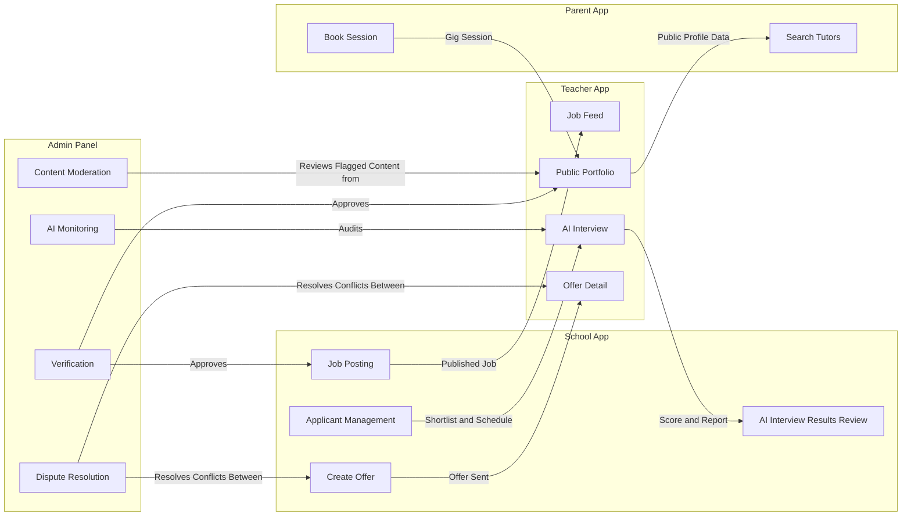

# SCORTEN — COMPLETE SCREEN-BY-SCREEN DOCUMENTATION
## Master Index

Based on: Scorten PRD v1.0 (AI-Powered Teacher Hiring & Professional Growth Platform)

This documentation set covers all 4 user-facing applications, with every screen's **fields**, **buttons**, and **navigation/redirect logic** mapped out, plus Mermaid flow diagrams per module and a master flow diagram per app.

---

## Files in this set

| File | Covers |
|---|---|
| `01-teacher-app.md` | Teacher App — 20 modules, ~45 screens. Auth → Profile → Resume → Job Discovery → Applications → AI Interview → School Interview → Messaging → Offers → Wallet → Payments → Gigs → Skill Tests → Courses → Analytics → Leaderboard → Portfolio → AI Coach → Support → Settings |
| `02-school-app.md` | School App — 14 modules, ~35 screens. Auth → School Profile → Job Posting → Teacher Search → Applicant Management → AI Interview Setup → Interview Scheduling → Offers → Messaging → Payments → Analytics → Team Management → Support → Settings |
| `03-parent-app.md` | Parent App — 10 modules, ~25 screens. Auth → Parent/Child Profile → Tutor Discovery → Booking → Courses → Payments → Messaging → Reviews → Support → Settings |
| `04-admin-panel.md` | Admin Panel — 13 modules, ~30 screens. Auth/2FA → Dashboard → User Management → Verification → Moderation → Job/Application Oversight → Disputes → Payments & Finance → AI Monitoring → Support Tickets → Analytics → Broadcasts → Admin Settings |

---

## How each screen is documented

Every screen entry follows this consistent structure:

```
## Screen: [Name]
**Purpose:** What this screen is for

**Fields:** Table of input fields — name, type, validation rules

**Buttons:** Table of every button/CTA — what happens when tapped,
             and exactly which screen it redirects to

**Navigation Logic:** Conditional routing (e.g. profile complete vs incomplete,
                       verified vs pending)

**API:** Backend endpoints involved (from PRD Section 5 onward)
```

Each module ends with a **Mermaid flowchart** showing that module's internal screen-to-screen navigation. Each app document ends with one **Master Navigation Flow** diagram tying all modules together, plus the **Dashboard/Home root screen** spec and **Bottom Navigation / Sidebar** structure.

---

## Cross-App Connections (how the 4 apps talk to each other via shared data)



---

## Database Collections Reference (from PRD Section 4)

These collections back every screen's data across all 4 apps:

`users`, `teacher_profiles`, `school_profiles`, `jobs`, `applications`, `interviews`, `ai_interviews`, `messages`, `offers`, `wallets`, `transactions`, `gigs`, `bookings`, `reviews`, `courses`, `course_enrollments`, `skill_tests`, `test_attempts`, `leaderboards`, `notifications`, `tickets`, `activity_logs`

Additional collections implied by this documentation (not explicit in original PRD, recommended for completeness):
- `disputes` (Admin Module 07)
- `moderation_queue` (Admin Module 05)
- `admin_users` (Admin Module 13)
- `school_branches` (School Module 02)
- `parent_profiles`, `children` (Parent Module 02)

---

## Suggested Build Order (Phase 1 per PRD Section 25)

1. Authentication (all 4 apps) — shared auth service
2. Teacher Profile + School Profile + Verification (Admin)
3. Job Posting (School) + Job Discovery (Teacher)
4. Application Tracking + Applicant Management
5. AI Interview (Teacher + School review side) + AI Monitoring (Admin)
6. School Interview Scheduling + Live Video Room
7. Messaging (shared component across all apps)
8. Offer Management
9. Wallet + Payments (Razorpay) — shared service
10. Gig Marketplace (Teacher) + Booking (Parent)
11. Skill Tests + Courses
12. Portfolio + Leaderboard
13. Support Tickets (all apps + Admin side)
14. Settings (all apps)
15. Admin: User Management, Moderation, Disputes, Analytics, Broadcasts

Phase 2 (PRD Section 26): Advanced AI Coach, Community, Certification Marketplace, Teaching Simulator, Advanced Analytics, full Parent Marketplace expansion.

---

**Read each app file individually for full screen-by-screen detail with fields, buttons, and flow diagrams.**
