# SCORTEN — TEACHER APP
## Complete Screen-by-Screen Documentation

---

## INDEX

| Module | Screens |
|---|---|
| 01 Authentication | Splash, Welcome, Login, Register, OTP Verify, Forgot Password, Reset Password |
| 02 Teacher Profile | Profile Setup Wizard (6 steps), Profile View, Edit Profile |
| 03 Resume Builder | Resume Builder, Resume Preview, Resume Templates |
| 04 Job Discovery | Job Feed, Job Filters, Job Detail |
| 05 Application Tracking | My Applications, Application Detail |
| 06 AI Interview | AI Interview Intro, AI Interview Session, AI Interview Report |
| 07 School Interview | Interview Invite, Interview Schedule, Live Interview Room, Interview Feedback |
| 08 Messaging | Chat List, Chat Conversation, File/Voice Share |
| 09 Offer Management | Offers List, Offer Detail, Digital Signature |
| 10 Wallet & Credits | Wallet Home, Add Credits, Transaction History |
| 11 Payments | Payment Checkout, Payment Success/Fail, Subscription Plans |
| 12 Freelance Marketplace | My Gigs, Create Gig, Gig Bookings |
| 13 Skill Assessments | Test Catalog, Test Instructions, Test Attempt, Test Result |
| 14 Courses | Course Catalog, Course Detail, Course Player, Certificate |
| 15 Analytics | Teacher Analytics Dashboard |
| 16 Leaderboard | Leaderboard Screen |
| 17 Portfolio | Public Portfolio, Portfolio Settings |
| 18 AI Career Coach | AI Coach Chat, Career Insights |
| 19 Support | Help Center, Raise Ticket, Ticket Detail |
| 20 Settings | Settings Home, Account Settings, Notification Settings, Privacy, Language |

---

# MODULE 01 — AUTHENTICATION

## Screen: Splash Screen
**Purpose:** App load screen, checks auth token validity.

**Fields:** None (logo + loader only)

**Buttons:** None (auto-redirect, timer ~2s)

**Navigation Logic:**
- If valid JWT token exists → redirect to **Dashboard (Home)**
- If no token / expired token → redirect to **Welcome Screen**

**API Call:** `GET /auth/verify-token` (silent, on load)

---

## Screen: Welcome Screen
**Purpose:** First-time entry point, brand intro, role confirmation.

**Fields:** None

**Buttons:**
| Button | Action |
|---|---|
| "I'm a Teacher" | → confirms role context = teacher → **Login/Register Screen** |
| "Login" | → **Login Screen** |
| "Create Account" | → **Register Screen** |

**Navigation Logic:** Entry screen for unauthenticated users.

---

## Screen: Login Screen
**Purpose:** Existing user authentication.

**Fields:**
| Field | Type | Validation |
|---|---|---|
| Mobile Number / Email | Text input (toggle tab) | Required, format check |
| Password | Password input (masked, show/hide toggle) | Required if email login |

**Buttons:**
| Button | Action |
|---|---|
| "Login" | → API `POST /auth/login` → on success → **Dashboard**; on first-time profile incomplete → **Profile Setup Wizard Step 1** |
| "Forgot Password?" | → **Forgot Password Screen** |
| "Login with OTP" | → toggles flow → **OTP Verification Screen** (after entering mobile) |
| "Create Account" (link at bottom) | → **Register Screen** |
| "Continue with Google" | → Firebase Google Auth → on success → **Dashboard** or **Profile Setup** |

**Navigation Logic:**
- Login success + `profile_completion < 100%` and `first_login = true` → **Profile Setup Wizard**
- Login success + existing profile → **Dashboard**
- Login fail → inline error, stay on screen

**API:** `POST /auth/login`

---

## Screen: Register Screen
**Purpose:** New teacher account creation.

**Fields:**
| Field | Type | Validation |
|---|---|---|
| Full Name | Text | Required |
| Mobile Number | Text (numeric, 10-digit) | Required, unique check |
| Email | Email input | Required, format + unique check |
| Password | Password (masked) | Min 8 chars, 1 number, 1 special char |
| Confirm Password | Password (masked) | Must match Password |
| Role Selection | Auto-set = "Teacher" (hidden/locked since entered via Teacher flow) | — |
| Terms & Privacy Checkbox | Checkbox | Required (must be checked) |

**Buttons:**
| Button | Action |
|---|---|
| "Create Account" | → API `POST /auth/register` → → **OTP Verification Screen** |
| "Already have an account? Login" | → **Login Screen** |

**Navigation Logic:** On successful registration, OTP auto-sent to mobile/email → forwards to OTP screen with `user_id` context.

**API:** `POST /auth/register`, internally triggers `POST /auth/send-otp`

---

## Screen: OTP Verification Screen
**Purpose:** Verify mobile/email ownership.

**Fields:**
| Field | Type | Validation |
|---|---|---|
| OTP Code | 6-digit OTP input (auto-focus boxes) | Required, 6 digits, expires in 5 min |

**Buttons:**
| Button | Action |
|---|---|
| "Verify" | → API `POST /auth/verify-otp` → success → **Profile Setup Wizard Step 1** (new user) or **Dashboard** (returning, e.g. login-via-OTP flow) |
| "Resend OTP" | Disabled for 30s countdown → then active → re-triggers `POST /auth/send-otp` |
| "Change Number" (back arrow) | → **Register Screen** / **Login Screen** (whichever initiated) |

**Navigation Logic:**
- Context flag `source = register` → after verify → **Profile Setup Wizard**
- Context flag `source = login_otp` → after verify → **Dashboard**

**API:** `POST /auth/verify-otp`

---

## Screen: Forgot Password Screen
**Purpose:** Initiate password reset.

**Fields:**
| Field | Type | Validation |
|---|---|---|
| Mobile Number / Email | Text input | Required, must exist in system |

**Buttons:**
| Button | Action |
|---|---|
| "Send Reset Code" | → API `POST /auth/forgot-password` → **OTP Verification Screen** (reset context) |
| "Back to Login" | → **Login Screen** |

**API:** `POST /auth/forgot-password`

---

## Screen: Reset Password Screen
**Purpose:** Set new password after OTP verification.

**Fields:**
| Field | Type | Validation |
|---|---|---|
| New Password | Password (masked) | Min 8 chars, 1 number, 1 special char |
| Confirm New Password | Password (masked) | Must match |

**Buttons:**
| Button | Action |
|---|---|
| "Reset Password" | → API `POST /auth/reset-password` → success toast → **Login Screen** |

**API:** `POST /auth/reset-password`

---

### Module 01 Flow Diagram

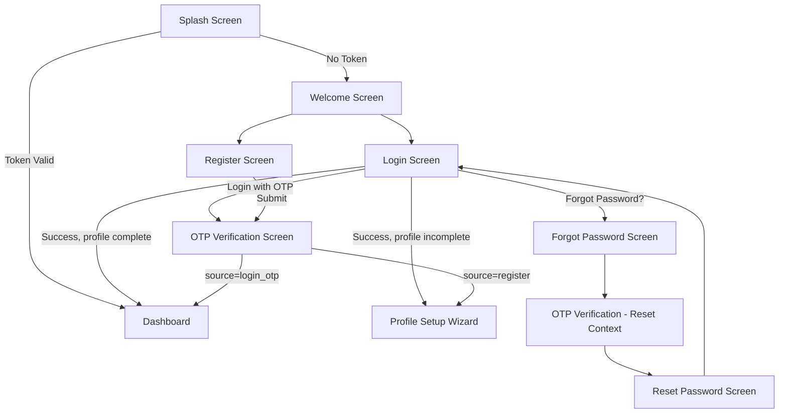
```mermaid
flowchart TD
    A[Splash Screen] -->|Token Valid| B[Dashboard]
    A -->|No Token| C[Welcome Screen]
    C --> D[Login Screen]
    C --> E[Register Screen]
    D -->|Forgot Password?| F[Forgot Password Screen]
    D -->|Login with OTP| G[OTP Verification Screen]
    D -->|Success, profile incomplete| H[Profile Setup Wizard]
    D -->|Success, profile complete| B
    E -->|Submit| G
    G -->|source=register| H
    G -->|source=login_otp| B
    F --> G2[OTP Verification - Reset Context]
    G2 --> I[Reset Password Screen]
    I --> D
```

---

# MODULE 02 — TEACHER PROFILE

## Screen: Profile Setup Wizard (Multi-Step, First-Time Only)

### Step 1: Personal Information
**Fields:**
| Field | Type | Validation |
|---|---|---|
| Profile Photo | Image upload | Optional, jpg/png, max 5MB |
| Full Name | Text | Pre-filled from registration, editable |
| Date of Birth | Date picker | Required |
| Gender | Dropdown (Male/Female/Other) | Required |
| City | Text/Autocomplete | Required |
| State | Dropdown | Required |
| Pin Code | Numeric | Required, 6-digit |
| Languages Known | Multi-select chips | Required, min 1 |

**Buttons:**
| Button | Action |
|---|---|
| "Next" | → validates fields → saves via `PATCH /teacher-profiles/:id` → **Step 2: Teaching Information** |
| "Skip for Now" | → **Dashboard** (profile marked incomplete, banner shown) |

---

### Step 2: Teaching Information
**Fields:**
| Field | Type | Validation |
|---|---|---|
| Subjects Taught | Multi-select chips | Required, min 1 |
| Grade Levels | Multi-select (Pre-Primary/Primary/Middle/Secondary/Senior Secondary) | Required |
| Boards Familiar With | Multi-select (CBSE/ICSE/IB/State Board/IGCSE) | Required |
| Preferred Mode | Radio (Online/Offline/Hybrid) | Required |
| Preferred Job Type | Radio (Full-time/Part-time/Freelance) | Required |
| Expected Salary Range | Range slider / two numeric fields | Optional |
| Preferred Locations | Multi-select/autocomplete | Required if Offline/Hybrid |

**Buttons:**
| Button | Action |
|---|---|
| "Back" | → **Step 1** |
| "Next" | → **Step 3: Experience** |

---

### Step 3: Experience
**Fields (repeatable entry block):**
| Field | Type | Validation |
|---|---|---|
| School/Institute Name | Text | Required |
| Designation | Text | Required |
| Subjects Taught There | Multi-select | Required |
| Start Date | Date picker | Required |
| End Date | Date picker / "Currently Working" toggle | Required unless current |
| Description | Textarea | Optional |

**Buttons:**
| Button | Action |
|---|---|
| "+ Add Another Experience" | → adds new repeatable block |
| "Remove" (per block) | → removes block |
| "Back" | → **Step 2** |
| "Next" | → **Step 4: Qualifications** |
| "I'm a Fresher / Skip" | → marks `experience = []` → **Step 4** |

---

### Step 4: Qualifications
**Fields (repeatable entry block):**
| Field | Type | Validation |
|---|---|---|
| Degree/Certification Name | Text/Dropdown | Required |
| Institution Name | Text | Required |
| Year of Completion | Numeric/Year picker | Required |
| Grade/Percentage/CGPA | Text | Optional |
| Upload Certificate | File upload (PDF/Image) | Optional, max 10MB |

**Buttons:**
| Button | Action |
|---|---|
| "+ Add Another Qualification" | → new block |
| "Back" | → **Step 3** |
| "Next" | → **Step 5: Documents** |

---

### Step 5: Documents
**Fields:**
| Field | Type | Validation |
|---|---|---|
| Government ID (Aadhaar/PAN) | File upload | Required, PDF/Image, max 10MB |
| Educational Certificates | Multi-file upload | Required min 1 |
| Police Verification / Background Check Doc | File upload | Optional (required for some schools) |
| Resume (if pre-built) | File upload (PDF) | Optional |

**Buttons:**
| Button | Action |
|---|---|
| "Back" | → **Step 4** |
| "Next" | → **Step 6: Demo Video** |

**API:** Files uploaded to AWS S3 via signed URL → `POST /teacher-profiles/:id/documents`

---

### Step 6: Demo Video Upload
**Fields:**
| Field | Type | Validation |
|---|---|---|
| Demo Class Video | Video upload (max 5 min) OR "Record Now" in-app camera | Optional but strongly recommended, mp4, max 200MB |
| Subject of Demo | Dropdown | Required if video uploaded |

**Buttons:**
| Button | Action |
|---|---|
| "Record Now" | → opens in-app camera recorder → returns to this step with preview |
| "Upload from Gallery" | → file picker |
| "Back" | → **Step 5** |
| "Finish Setup" | → API `POST /teacher-profiles/:id/complete` → triggers AI Profile Score calculation → **Profile Score Reveal Screen** |
| "Skip Video" | → **Profile Score Reveal Screen** (lower initial score) |

**Navigation Logic:** Video, once uploaded, queues async job → **Video Analysis Engine** (Module 12) processes in background; score updates push notification later if skipped at this step.

---

## Screen: Profile Score Reveal Screen
**Purpose:** Show calculated AI Profile Score after setup.

**Fields:** Display-only — Score (0-100 circular gauge), breakdown bars (Personal Info 15%, Qualifications 20%, Experience 15%, Demo Videos 20%, Assessments 15%, Portfolio 15%)

**Buttons:**
| Button | Action |
|---|---|
| "Go to Dashboard" | → **Dashboard** |
| "Improve Score" | → **Profile View Screen** (highlights weak sections) |

---

## Screen: Profile View Screen
**Purpose:** Teacher's own full profile view (also what schools see, with edit affordances added).

**Fields (Display):**
- Profile Photo, Name, Profile Score badge
- Personal Info section
- Teaching Info section
- Experience timeline
- Qualifications list
- Documents (locked icons if verified)
- Demo Videos (playable)
- Skills & Badges
- Achievements
- Ratings & Reviews summary
- Portfolio link preview

**Buttons:**
| Button | Action |
|---|---|
| "Edit Profile" (pencil icon, top) | → **Edit Profile Screen** |
| "Edit" (per-section pencil icons) | → jumps to relevant **Edit Profile** sub-section |
| "View Public Portfolio" | → **Public Portfolio Screen** (Module 17) |
| "Add Demo Video" | → re-opens **Step 6 Demo Video** flow |
| "Take Skill Assessment" (if score low) | → **Test Catalog Screen** (Module 13) |
| Back arrow | → **Dashboard** |

---

## Screen: Edit Profile Screen
**Purpose:** Edit any profile field post-setup. Mirrors Wizard Steps 1-5 fields but as a single tabbed/accordion screen instead of stepper.

**Fields:** Same as Steps 1-5 fields, grouped in tabs: Personal | Teaching Info | Experience | Qualifications | Documents

**Buttons:**
| Button | Action |
|---|---|
| "Save Changes" (per tab or global) | → API `PATCH /teacher-profiles/:id` → success toast → stays on screen / returns to **Profile View** |
| "Cancel" | → discards changes → **Profile View Screen** |
| Back arrow | → prompts "Discard changes?" if dirty → **Profile View Screen** |

---

### Module 02 Flow Diagram

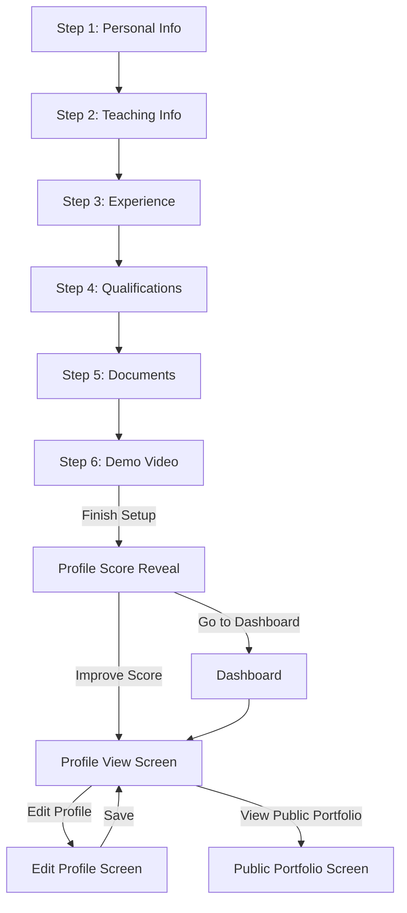
```mermaid
flowchart TD
    A[Step 1: Personal Info] --> B[Step 2: Teaching Info]
    B --> C[Step 3: Experience]
    C --> D[Step 4: Qualifications]
    D --> E[Step 5: Documents]
    E --> F[Step 6: Demo Video]
    F -->|Finish Setup| G[Profile Score Reveal]
    G -->|Go to Dashboard| H[Dashboard]
    G -->|Improve Score| I[Profile View Screen]
    H --> I
    I -->|Edit Profile| J[Edit Profile Screen]
    J -->|Save| I
    I -->|View Public Portfolio| K[Public Portfolio Screen]
```

---

# MODULE 03 — RESUME BUILDER

## Screen: Resume Templates Screen
**Purpose:** Choose a resume design template.

**Fields:** Template thumbnails grid (selectable cards)

**Buttons:**
| Button | Action |
|---|---|
| Template Card (tap) | → selects template → **Resume Builder Screen** |
| "Use My Profile Data" toggle | → auto-fills builder from existing Teacher Profile |

---

## Screen: Resume Builder Screen
**Purpose:** Build/edit resume content (auto-pulled from profile, editable independently).

**Fields:**
| Field | Type |
|---|---|
| Summary/Objective | Textarea |
| Experience entries | Repeatable (pulled from profile, editable) |
| Qualifications entries | Repeatable (pulled from profile, editable) |
| Skills | Tag input |
| Achievements | Repeatable text list |
| Custom Sections | Add/remove freeform sections |

**Buttons:**
| Button | Action |
|---|---|
| "Preview" | → **Resume Preview Screen** |
| "Save Draft" | → API `PATCH /teacher-profiles/:id/resume` |
| "Change Template" | → **Resume Templates Screen** |
| Back arrow | → **Profile View Screen** |

---

## Screen: Resume Preview Screen
**Purpose:** Final PDF-style preview before download/use.

**Fields:** Display-only rendered resume

**Buttons:**
| Button | Action |
|---|---|
| "Download PDF" | → generates PDF → device download/share sheet |
| "Edit" | → back to **Resume Builder Screen** |
| "Set as Application Resume" | → marks this resume as default for job applications → confirmation toast |
| Back arrow | → **Resume Builder Screen** |

---

### Module 03 Flow Diagram

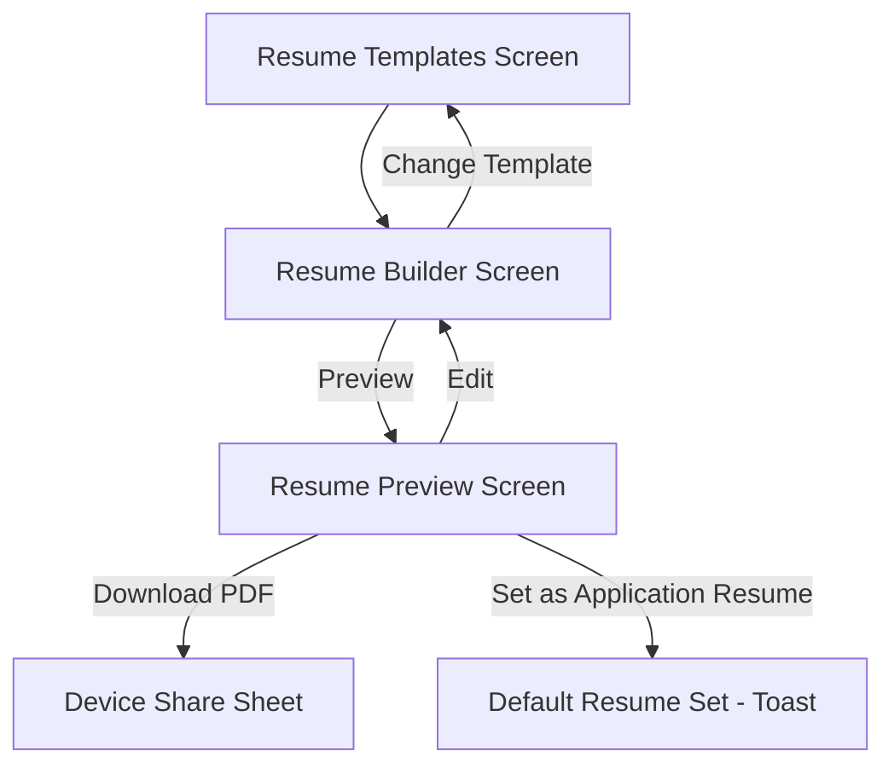
```mermaid
flowchart TD
    A[Resume Templates Screen] --> B[Resume Builder Screen]
    B -->|Preview| C[Resume Preview Screen]
    C -->|Edit| B
    C -->|Download PDF| D[Device Share Sheet]
    C -->|Set as Application Resume| E[Default Resume Set - Toast]
    B -->|Change Template| A
```

---

# MODULE 04 — JOB DISCOVERY

## Screen: Job Feed Screen
**Purpose:** Main job listing feed, AI-matched jobs prioritized at top.

**Fields:**
| Field | Type |
|---|---|
| Search Bar | Text input (search by title/subject/school) |
| AI Match Badge (per card) | Display-only, % match score |
| Job Card (repeated) | Display: Title, School Name, Salary, Location, Mode, Posted date |

**Buttons:**
| Button | Action |
|---|---|
| "Filters" icon | → **Job Filters Screen (Bottom Sheet/Modal)** |
| Job Card (tap) | → **Job Detail Screen** |
| Bookmark icon (per card) | → toggles save → adds to "Saved Jobs" list (no navigation) |
| Bottom Nav: Home / Jobs / Messages / Profile / More | → switches root tab |

**Navigation Logic:** Default landing tab after Dashboard for most teachers. Pull-to-refresh re-fetches via `GET /jobs?match=true`.

**API:** `GET /jobs`, `GET /jobs/recommended`

---

## Screen: Job Filters Screen (Modal/Bottom Sheet)
**Purpose:** Refine job feed.

**Fields:**
| Field | Type |
|---|---|
| Subject | Multi-select |
| Location/City | Autocomplete multi-select |
| Salary Range | Range slider |
| Board | Multi-select |
| Mode (Online/Offline/Hybrid) | Checkbox group |
| Job Type (Full-time/Part-time) | Checkbox group |
| Posted Within | Dropdown (24h/7d/30d/Anytime) |

**Buttons:**
| Button | Action |
|---|---|
| "Apply Filters" | → applies → returns to **Job Feed Screen** (filtered) |
| "Reset" | → clears all → **Job Feed Screen** (unfiltered) |
| Close (X) | → dismiss without applying → **Job Feed Screen** |

---

## Screen: Job Detail Screen
**Purpose:** Full job description and apply entry point.

**Fields (Display):**
- Job Title, School Name + Logo, Location, Salary, Board, Mode, Subject, Grade Level
- Requirements list
- Job Description (rich text)
- Application Deadline
- "AI Match Score" for this teacher vs this job
- School's other open jobs (carousel)
- School profile preview (rating, verified badge)

**Buttons:**
| Button | Action |
|---|---|
| "Apply Now" | → if profile/resume incomplete → prompts **Resume Preview confirmation modal**; else → API `POST /applications` → **Application Confirmation Screen** (or toast) → **My Applications Screen** |
| "Save Job" (bookmark) | → toggles saved state |
| "View School Profile" | → **School Profile View Screen** (read-only school public profile) |
| "Share Job" | → device share sheet |
| Back arrow | → **Job Feed Screen** |

**Navigation Logic:** If job `status != Open` (Paused/Closed/Expired) → "Apply Now" button disabled, shows status label instead.

**API:** `GET /jobs/:id`, `POST /applications`

---

### Module 04 Flow Diagram

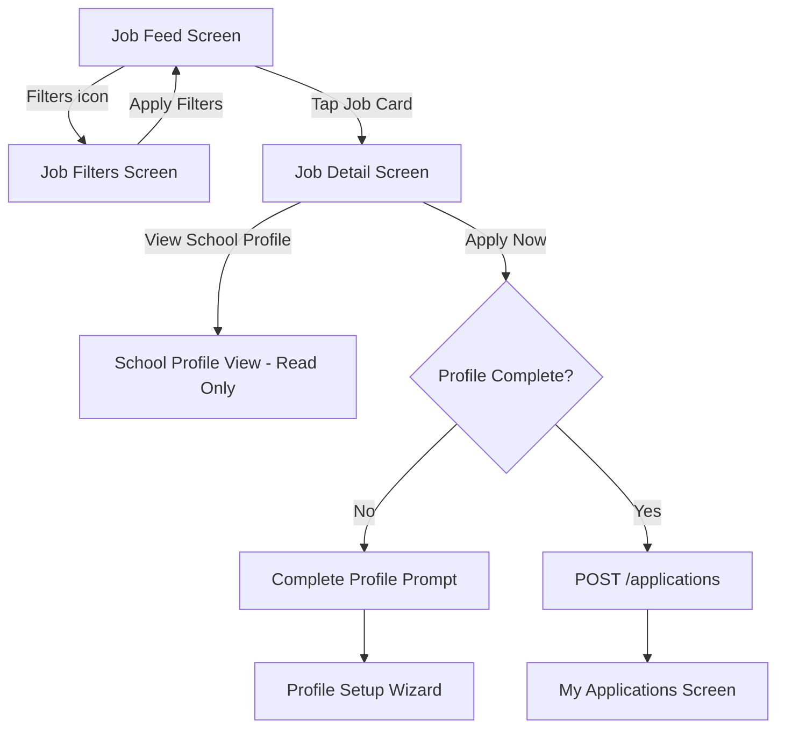
```mermaid
flowchart TD
    A[Job Feed Screen] -->|Filters icon| B[Job Filters Screen]
    B -->|Apply Filters| A
    A -->|Tap Job Card| C[Job Detail Screen]
    C -->|View School Profile| D[School Profile View - Read Only]
    C -->|Apply Now| E{Profile Complete?}
    E -->|No| F[Complete Profile Prompt]
    F --> G[Profile Setup Wizard]
    E -->|Yes| H[POST /applications]
    H --> I[My Applications Screen]
```

---

# MODULE 05 — APPLICATION TRACKING

## Screen: My Applications Screen
**Purpose:** List all applications with status pipeline.

**Fields:**
| Field | Type |
|---|---|
| Status Tabs/Filter | Tabs: All / Applied / Shortlisted / Interview / Offer / Rejected |
| Application Card (repeated) | Display: School Name, Job Title, Status badge, Applied Date |

**Buttons:**
| Button | Action |
|---|---|
| Application Card (tap) | → **Application Detail Screen** |
| "Withdraw" (swipe action or icon, only if status = Applied/AI Screened) | → confirmation modal → API `PATCH /applications/:id` (status=Withdrawn) |
| Bottom Nav | → switches root tab |

**API:** `GET /applications?teacher_id=me`

---

## Screen: Application Detail Screen
**Purpose:** Full status timeline and actions for one application.

**Fields (Display):**
- Job + School summary card
- Status Timeline (visual stepper): Applied → AI Screened → Shortlisted → Interview Scheduled → Interview Completed → Offer Sent → Hired/Rejected
- AI Screening result summary (if applicable)
- Interview details (if scheduled) with date/time

**Buttons:**
| Button | Action |
|---|---|
| "View Job Details" | → **Job Detail Screen** |
| "Message School" | → **Chat Conversation Screen** (Module 08), pre-linked to this application/school |
| "Join AI Interview" (if status=AI Screened pending and invite active) | → **AI Interview Intro Screen** |
| "View Interview Schedule" (if Interview Scheduled) | → **Interview Schedule Screen** (Module 07) |
| "View Offer" (if status=Offer Sent) | → **Offer Detail Screen** (Module 09) |
| "Withdraw Application" | → confirmation modal → updates status |
| Back arrow | → **My Applications Screen** |

---

### Module 05 Flow Diagram

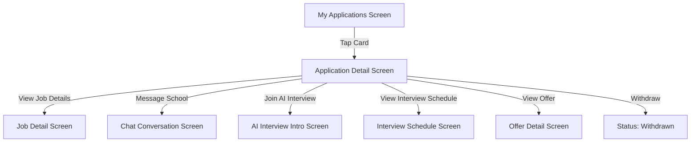
```mermaid
flowchart TD
    A[My Applications Screen] -->|Tap Card| B[Application Detail Screen]
    B -->|View Job Details| C[Job Detail Screen]
    B -->|Message School| D[Chat Conversation Screen]
    B -->|Join AI Interview| E[AI Interview Intro Screen]
    B -->|View Interview Schedule| F[Interview Schedule Screen]
    B -->|View Offer| G[Offer Detail Screen]
    B -->|Withdraw| H[Status: Withdrawn]
```

---

# MODULE 06 — AI INTERVIEW

## Screen: AI Interview Intro Screen
**Purpose:** Pre-interview instructions and consent.

**Fields (Display):**
- Instructions list (camera/mic check, duration ~15-20 min, no retakes, etc.)
- Job/School context this interview is tied to
- Device check status (camera ✓, mic ✓, lighting ✓)

**Buttons:**
| Button | Action |
|---|---|
| "Run Device Check" | → triggers camera/mic test (in-screen preview) |
| "Start Interview" | → enabled only after device check passes → **AI Interview Session Screen** |
| "Remind Me Later" | → schedules notification → **Application Detail Screen** |
| Back arrow | → **Application Detail Screen** |

---

## Screen: AI Interview Session Screen
**Purpose:** Live AI-driven interview — question generation, video recording, real-time flow.

**Fields:**
| Field | Type |
|---|---|
| Current Question (AI-generated, text + voice playback) | Display |
| Video Preview (self-camera feed) | Live video |
| Timer per question | Countdown display |
| Recording indicator | Display |

**Buttons:**
| Button | Action |
|---|---|
| "Start Recording Answer" | → begins capture |
| "Stop & Next" | → stops recording, submits answer chunk → loads next AI-generated question |
| "Pause Interview" (limited, e.g. 1 allowed pause) | → pause modal → "Resume" button |
| "End Interview Early" | → confirmation modal ("Your interview will be scored on completed questions") → submits → **AI Interview Report Screen (Processing State)** |

**Navigation Logic:** Sequential question flow — Question Generation → Video Recording → (auto) Speech Analysis happens server-side after each segment or full session end. On final question submitted → auto-redirect to **Report Processing Screen**.

**API:** `POST /ai-interviews/:id/start`, `POST /ai-interviews/:id/answer` (per question), `POST /ai-interviews/:id/complete`

---

## Screen: AI Interview Report Screen
**Purpose:** Show AI-generated scoring report.

**States:**
1. **Processing State** — loader: "Analyzing your responses..." (polls job status)
2. **Result State** — full report

**Fields (Result State, Display):**
- Overall Score (0-100)
- Breakdown: Communication, Confidence, Subject Knowledge, Teaching Ability, Behavioral Score
- AI Recommendation summary (text)
- Comparison to job requirements

**Buttons:**
| Button | Action |
|---|---|
| "View Full Report" (expand) | → expands detailed per-question breakdown inline |
| "Share to Profile" | → confirms report stored/visible on Profile (auto-stored by default per spec; this may toggle public visibility) |
| "Back to Application" | → **Application Detail Screen** |
| "Retake" (only if policy allows / school permits) | → **AI Interview Intro Screen** |

**Navigation Logic:** Report auto-saves to `teacher_profiles.ai_interview_reports[]` and contributes to AI Profile Score.

**API:** `GET /ai-interviews/:id/report`

---

### Module 06 Flow Diagram

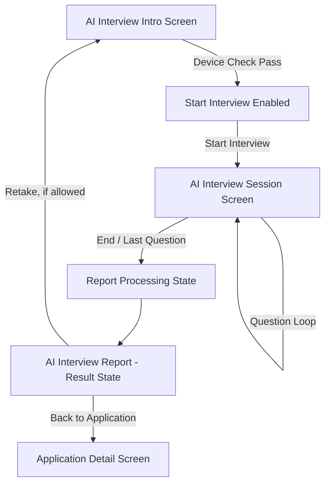
```mermaid
flowchart TD
    A[AI Interview Intro Screen] -->|Device Check Pass| B[Start Interview Enabled]
    B -->|Start Interview| C[AI Interview Session Screen]
    C -->|Question Loop| C
    C -->|End / Last Question| D[Report Processing State]
    D --> E[AI Interview Report - Result State]
    E -->|Back to Application| F[Application Detail Screen]
    E -->|Retake, if allowed| A
```

---

# MODULE 07 — SCHOOL INTERVIEW

## Screen: Interview Invite Screen
**Purpose:** Notification-driven screen showing a school's live interview invite.

**Fields (Display):**
- School Name, Job Title
- Proposed Date/Time slots (if school proposed multiple)
- Interview Mode (Video Call / In-Person, with address if in-person)

**Buttons:**
| Button | Action |
|---|---|
| "Accept & Schedule" | → **Interview Schedule Screen** (confirm slot) |
| "Request Reschedule" | → opens reason + alternate time picker → sends request to school → stays on screen with "Pending School Response" state |
| "Decline" | → confirmation modal → updates application status, school notified |
| Back arrow | → **Application Detail Screen** |

---

## Screen: Interview Schedule Screen
**Purpose:** Confirm final time slot and view interview details/reminders.

**Fields (Display):**
- Confirmed Date/Time
- Mode (Video Call link generated via Agora/100ms, or physical address)
- Add to Calendar option

**Buttons:**
| Button | Action |
|---|---|
| "Add to Calendar" | → device calendar integration |
| "Join Video Call" (active only within ~10 min window of scheduled time) | → **Live Interview Room Screen** |
| "Message School" | → **Chat Conversation Screen** |
| "Cancel Interview" | → confirmation modal → status update |
| Back arrow | → **Application Detail Screen** |

---

## Screen: Live Interview Room Screen
**Purpose:** Real-time video interview (Agora/100ms SDK).

**Fields:**
| Field | Type |
|---|---|
| Video feed (self + interviewer(s)) | Live video grid |
| Mic/Camera toggle controls | Buttons |
| Chat sidebar (text during call) | Text input + thread |

**Buttons:**
| Button | Action |
|---|---|
| Mute/Unmute | Toggles mic |
| Camera On/Off | Toggles video |
| "Leave Call" | → confirmation → **Interview Feedback Screen** (post-call) |
| "Share Screen" (if enabled) | Toggles screen share |

**API:** Agora/100ms token via `POST /interviews/:id/join`

---

## Screen: Interview Feedback Screen
**Purpose:** Post-interview, teacher-side experience rating (not the score — that's school-side).

**Fields:**
| Field | Type |
|---|---|
| Rate your interview experience | Star rating (1-5) |
| Comments | Textarea, optional |

**Buttons:**
| Button | Action |
|---|---|
| "Submit Feedback" | → API `POST /interviews/:id/feedback` → **Application Detail Screen** |
| "Skip" | → **Application Detail Screen** |

---

### Module 07 Flow Diagram

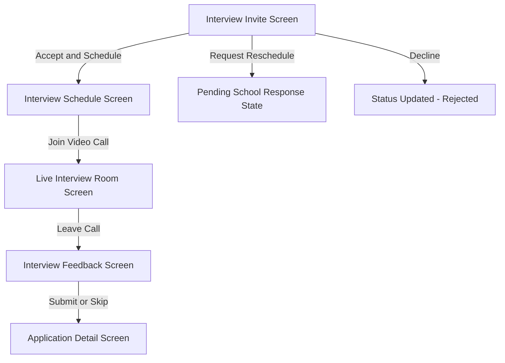
```mermaid
flowchart TD
    A[Interview Invite Screen] -->|Accept and Schedule| B[Interview Schedule Screen]
    A -->|Request Reschedule| C[Pending School Response State]
    A -->|Decline| D[Status Updated - Rejected]
    B -->|Join Video Call| E[Live Interview Room Screen]
    E -->|Leave Call| F[Interview Feedback Screen]
    F -->|Submit or Skip| G[Application Detail Screen]
```

---

# MODULE 08 — MESSAGING

## Screen: Chat List Screen
**Purpose:** All conversations (with schools, parents-for-gigs, support).

**Fields:**
| Field | Type |
|---|---|
| Search conversations | Text input |
| Conversation Card (repeated) | Display: Name/School, last message preview, timestamp, unread badge |

**Buttons:**
| Button | Action |
|---|---|
| Conversation Card (tap) | → **Chat Conversation Screen** |
| Bottom Nav | → switches root tab |

**API:** `GET /messages/conversations`

---

## Screen: Chat Conversation Screen
**Purpose:** 1:1 real-time chat thread.

**Fields:**
| Field | Type |
|---|---|
| Message input box | Text input |
| Attachment picker | File/image picker |
| Voice note recorder | Hold-to-record button |

**Buttons:**
| Button | Action |
|---|---|
| "Send" | → sends message via socket/API → appends to thread |
| Attachment (paperclip icon) | → opens file picker → uploads → sends as message |
| Mic icon (hold) | → records voice note → release sends |
| Header: View Profile/Job context | → **Job Detail Screen** or **School Profile View** (context-dependent) |
| Back arrow | → **Chat List Screen** |

**API:** `GET /messages/:conversationId`, `POST /messages`, WebSocket channel for real-time updates

---

### Module 08 Flow Diagram

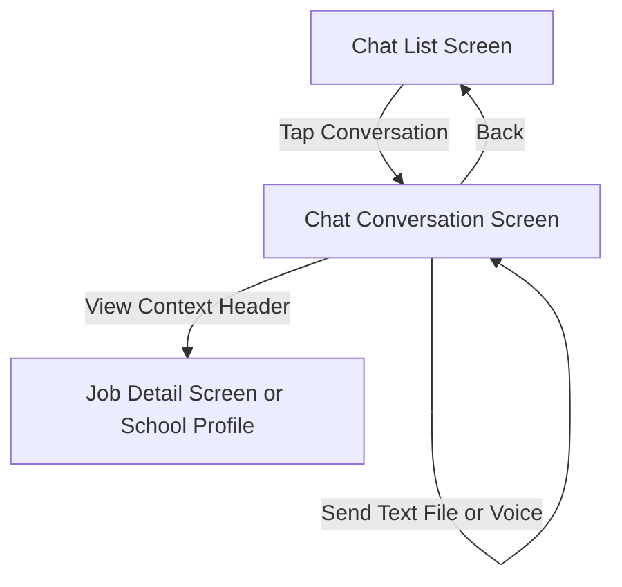
```mermaid
flowchart TD
    A[Chat List Screen] -->|Tap Conversation| B[Chat Conversation Screen]
    B -->|Send Text File or Voice| B
    B -->|View Context Header| C[Job Detail Screen or School Profile]
    B -->|Back| A
```

---

# MODULE 09 — OFFER MANAGEMENT

## Screen: Offers List Screen
**Purpose:** All offers received.

**Fields:**
| Field | Type |
|---|---|
| Status Filter Tabs | Viewed / Accepted / Rejected / Expired |
| Offer Card (repeated) | Display: School, Job Title, Salary, Status, Date |

**Buttons:**
| Button | Action |
|---|---|
| Offer Card (tap) | → **Offer Detail Screen** |
| Bottom Nav | → switches root tab |

**API:** `GET /offers?teacher_id=me`

---

## Screen: Offer Detail Screen
**Purpose:** Full offer terms, action center.

**Fields (Display):**
- School & Job Summary
- Salary/CTC breakdown
- Joining Date
- Terms & Conditions text
- Offer Letter PDF preview

**Buttons:**
| Button | Action |
|---|---|
| "Accept Offer" | → **Digital Signature Screen** |
| "Negotiate" | → opens counter-offer form (salary/date fields) → API `POST /offers/:id/negotiate` → status stays "Viewed", school notified |
| "Reject Offer" | → confirmation modal (optional reason) → API `PATCH /offers/:id` (status=Rejected) |
| "Download PDF" | → device download/share |
| "Message School" | → **Chat Conversation Screen** |
| Back arrow | → **Offers List Screen** |

**Navigation Logic:** First open of offer auto-marks status `Viewed` via `PATCH /offers/:id/view`.

---

## Screen: Digital Signature Screen
**Purpose:** Capture e-signature to finalize acceptance.

**Fields:**
| Field | Type |
|---|---|
| Signature Pad | Touch/draw canvas |
| Typed Name confirmation | Text input (alternative to drawing) |
| Acceptance Checkbox ("I agree to terms") | Checkbox, required |

**Buttons:**
| Button | Action |
|---|---|
| "Clear" | → clears signature pad |
| "Confirm & Accept" | → API `POST /offers/:id/accept` (with signature payload) → status=Accepted → **Offer Confirmation Screen** |
| Back arrow | → **Offer Detail Screen** |

---

## Screen: Offer Confirmation Screen
**Purpose:** Success state after accepting.

**Fields (Display):** Confirmation message, next steps, signed PDF download link

**Buttons:**
| Button | Action |
|---|---|
| "Download Signed Offer" | → device download |
| "Go to Dashboard" | → **Dashboard** |

---

### Module 09 Flow Diagram

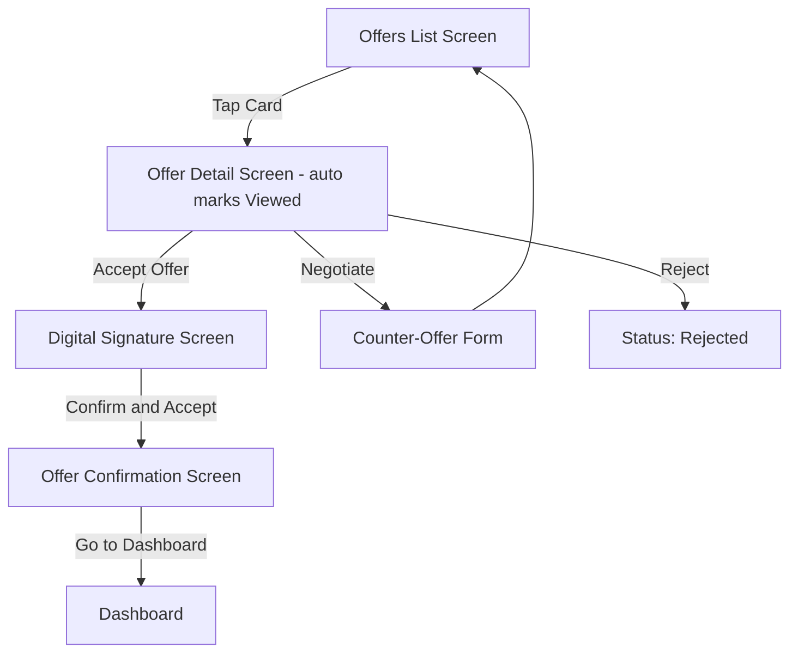
```mermaid
flowchart TD
    A[Offers List Screen] -->|Tap Card| B[Offer Detail Screen - auto marks Viewed]
    B -->|Accept Offer| C[Digital Signature Screen]
    B -->|Negotiate| D[Counter-Offer Form]
    D --> A
    B -->|Reject| E[Status: Rejected]
    C -->|Confirm and Accept| F[Offer Confirmation Screen]
    F -->|Go to Dashboard| G[Dashboard]
```

---

# MODULE 10 — WALLET & CREDITS

## Screen: Wallet Home Screen
**Purpose:** Credit balance and usage center.

**Fields (Display):**
- Current Credit Balance (large display)
- Credit Source breakdown (Referral / Purchases / Rewards / Gig Earnings)

**Buttons:**
| Button | Action |
|---|---|
| "Add Credits" | → **Add Credits Screen** |
| "Transaction History" | → **Transaction History Screen** |
| "Refer a Friend" | → opens referral share sheet with unique code/link |
| "Use Credits" quick actions: "Boost Profile" / "Buy AI Interview Credits" / "Feature Application" | → respective confirmation modal → deducts credits → success toast |
| Bottom Nav / Settings access | → switches root tab |

**API:** `GET /wallets/me`

---

## Screen: Add Credits Screen
**Purpose:** Purchase credit packages.

**Fields:**
| Field | Type |
|---|---|
| Credit Package Cards (e.g. 100/500/1000 credits) | Selectable cards |
| Custom Amount | Numeric input (optional) |

**Buttons:**
| Button | Action |
|---|---|
| Package Card (select) | → highlights selection |
| "Proceed to Pay" | → **Payment Checkout Screen** (Module 11) with amount pre-filled |
| Back arrow | → **Wallet Home Screen** |

---

## Screen: Transaction History Screen
**Purpose:** Full ledger of credit/wallet activity.

**Fields:**
| Field | Type |
|---|---|
| Filter (Date range / Type: Credit/Debit) | Filter controls |
| Transaction Row (repeated) | Display: Date, Description, Amount, Running Balance |

**Buttons:**
| Button | Action |
|---|---|
| Transaction Row (tap) | → expands detail (e.g. linked gig/payment ref) |
| "Download Statement" | → generates PDF/CSV → device share |
| Back arrow | → **Wallet Home Screen** |

**API:** `GET /transactions?wallet_id=me`

---

### Module 10 Flow Diagram

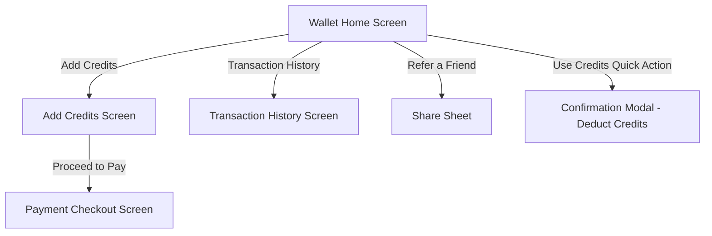
```mermaid
flowchart TD
    A[Wallet Home Screen] -->|Add Credits| B[Add Credits Screen]
    B -->|Proceed to Pay| C[Payment Checkout Screen]
    A -->|Transaction History| D[Transaction History Screen]
    A -->|Refer a Friend| E[Share Sheet]
    A -->|Use Credits Quick Action| F[Confirmation Modal - Deduct Credits]
```

---

# MODULE 11 — PAYMENTS

## Screen: Subscription Plans Screen
**Purpose:** Premium tier upsell (profile boost, priority applications, advanced analytics, etc.)

**Fields:**
| Field | Type |
|---|---|
| Plan Cards (Free / Pro / Premium) | Selectable cards with feature comparison |
| Billing Cycle Toggle | Monthly / Yearly |

**Buttons:**
| Button | Action |
|---|---|
| "Choose Plan" (per card) | → **Payment Checkout Screen** |
| Back arrow | → **Settings Home** or **Dashboard** (entry-point dependent) |

---

## Screen: Payment Checkout Screen
**Purpose:** Razorpay payment collection — used for credits, subscriptions, course purchases, gig payments.

**Fields:**
| Field | Type |
|---|---|
| Order Summary (item, amount, taxes, total) | Display |
| Payment Method Selection | Radio: Card / UPI / Net Banking / Wallet |
| Card/UPI Details | Razorpay SDK hosted fields |
| Promo Code | Text input, optional |

**Buttons:**
| Button | Action |
|---|---|
| "Apply Promo" | → validates → updates total |
| "Pay ₹[amount]" | → invokes Razorpay SDK checkout → on success → **Payment Success Screen**; on failure → **Payment Fail Screen** |
| Back arrow | → previous screen (Add Credits / Subscription Plans / Course Detail / Gig Booking) |

**API:** `POST /payments/create-order`, Razorpay webhook → `POST /payments/verify`

---

## Screen: Payment Success Screen
**Purpose:** Confirmation state.

**Fields (Display):** Success animation/icon, Order ID, Amount Paid, Item Purchased

**Buttons:**
| Button | Action |
|---|---|
| "View Receipt" | → PDF receipt view/download |
| "Continue" | → returns to originating context (Wallet Home / Course Player / Gig Booking confirmation) |

---

## Screen: Payment Fail Screen
**Purpose:** Failure state with retry path.

**Fields (Display):** Failure reason (if available), Order ID

**Buttons:**
| Button | Action |
|---|---|
| "Retry Payment" | → **Payment Checkout Screen** |
| "Contact Support" | → **Raise Ticket Screen** (Module 19) |
| "Cancel" | → returns to originating screen |

---

### Module 11 Flow Diagram

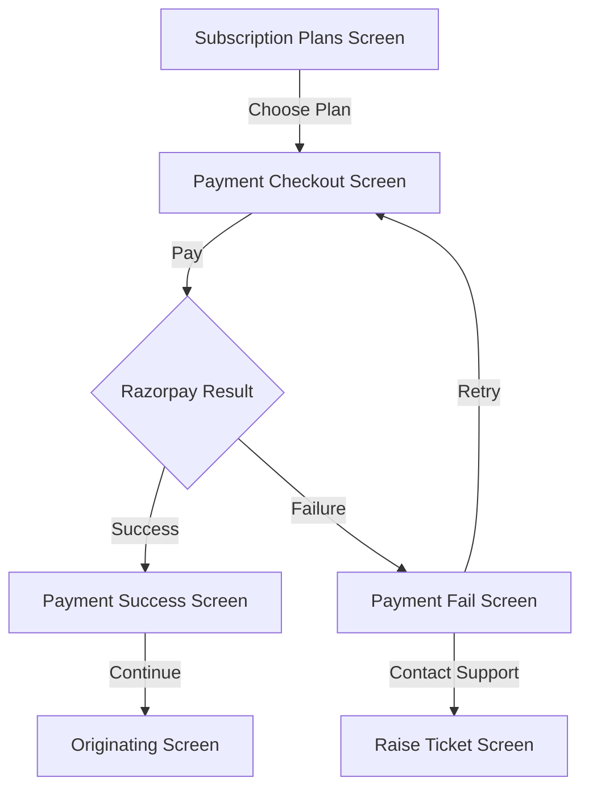
```mermaid
flowchart TD
    A[Subscription Plans Screen] -->|Choose Plan| B[Payment Checkout Screen]
    B -->|Pay| C{Razorpay Result}
    C -->|Success| D[Payment Success Screen]
    C -->|Failure| E[Payment Fail Screen]
    E -->|Retry| B
    E -->|Contact Support| F[Raise Ticket Screen]
    D -->|Continue| G[Originating Screen]
```

---

# MODULE 12 — FREELANCE MARKETPLACE (GIGS)

## Screen: My Gigs Screen
**Purpose:** Teacher's gig listings management.

**Fields:**
| Field | Type |
|---|---|
| Tabs: Active / Draft / Paused | Tab navigation |
| Gig Card (repeated) | Display: Title, Price, Bookings count, Rating |

**Buttons:**
| Button | Action |
|---|---|
| "+ Create Gig" | → **Create Gig Screen** |
| Gig Card (tap) | → **Gig Detail/Edit Screen** |
| "View Bookings" | → **Gig Bookings Screen** |
| Bottom Nav | → switches root tab |

**API:** `GET /gigs?teacher_id=me`

---

## Screen: Create Gig Screen
**Purpose:** Publish a new freelance offering (1:1 tutoring sessions, doubt-solving, etc.)

**Fields:**
| Field | Type | Validation |
|---|---|---|
| Gig Title | Text | Required |
| Category/Subject | Dropdown | Required |
| Description | Textarea | Required |
| Session Duration | Dropdown (30min/45min/60min) | Required |
| Price per Session | Numeric | Required |
| Availability Slots | Calendar/time-slot picker | Required, min 1 slot |
| Cover Image | Image upload | Optional |

**Buttons:**
| Button | Action |
|---|---|
| "Save as Draft" | → API `POST /gigs` (status=draft) → **My Gigs Screen** |
| "Publish" | → API `POST /gigs` (status=active) → **My Gigs Screen** |
| Back arrow | → **My Gigs Screen** (discard prompt if dirty) |

---

## Screen: Gig Bookings Screen
**Purpose:** Manage incoming/upcoming bookings for a gig.

**Fields:**
| Field | Type |
|---|---|
| Booking Card (repeated) | Display: Parent/Student Name, Date/Time, Status (Upcoming/Completed/Cancelled), Payment status |

**Buttons:**
| Button | Action |
|---|---|
| "Join Session" (active near scheduled time) | → **Live Interview Room**-style video screen (reuses Agora/100ms session component) |
| "Reschedule" | → opens slot picker → notifies parent |
| "Cancel Booking" | → confirmation modal → refund trigger |
| "Mark Complete" (post-session) | → API `PATCH /bookings/:id` → triggers payout queue |
| Back arrow | → **My Gigs Screen** |

**API:** `GET /bookings?gig_id=:id`

---

### Module 12 Flow Diagram

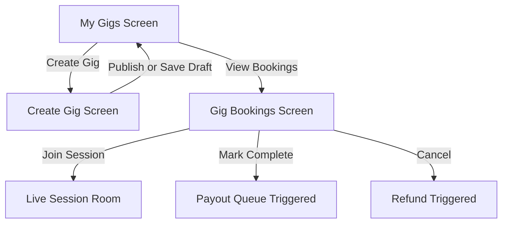
```mermaid
flowchart TD
    A[My Gigs Screen] -->|Create Gig| B[Create Gig Screen]
    B -->|Publish or Save Draft| A
    A -->|View Bookings| C[Gig Bookings Screen]
    C -->|Join Session| D[Live Session Room]
    C -->|Mark Complete| E[Payout Queue Triggered]
    C -->|Cancel| F[Refund Triggered]
```

---

# MODULE 13 — SKILL ASSESSMENTS

## Screen: Test Catalog Screen
**Purpose:** Browse available skill tests.

**Fields:**
| Field | Type |
|---|---|
| Subject Filter Tabs (Mathematics/Science/English/Computers/Others) | Tabs |
| Test Card (repeated) | Display: Test Name, Duration, Difficulty, Attempts left, Best Score (if attempted) |

**Buttons:**
| Button | Action |
|---|---|
| Test Card (tap) | → **Test Instructions Screen** |
| Bottom Nav | → switches root tab |

**API:** `GET /skill-tests`

---

## Screen: Test Instructions Screen
**Purpose:** Pre-test rules display.

**Fields (Display):** Number of questions, Duration, Passing score, Negative marking info (if any), Retake policy

**Buttons:**
| Button | Action |
|---|---|
| "Start Test" | → **Test Attempt Screen** |
| Back arrow | → **Test Catalog Screen** |

---

## Screen: Test Attempt Screen
**Purpose:** Live MCQ/test-taking interface.

**Fields:**
| Field | Type |
|---|---|
| Question text + options | Radio/checkbox per question |
| Question navigator (grid of question numbers) | Tap to jump |
| Timer | Countdown display |

**Buttons:**
| Button | Action |
|---|---|
| "Next" / "Previous" | → navigates questions |
| "Mark for Review" | → flags question in navigator |
| "Submit Test" | → confirmation modal → API `POST /test-attempts/:id/submit` → **Test Result Screen** |
| (Auto-submit on timer expiry) | → **Test Result Screen** |

**API:** `POST /test-attempts` (start), `PATCH /test-attempts/:id` (per answer autosave), `POST /test-attempts/:id/submit`

---

## Screen: Test Result Screen
**Purpose:** Score reveal.

**Fields (Display):**
- Skill Score
- Correct/Incorrect breakdown
- Badge earned (if threshold met)
- Leaderboard points earned

**Buttons:**
| Button | Action |
|---|---|
| "View Solutions" | → expands per-question correct answers/explanations |
| "Retake Test" (if attempts remaining) | → **Test Instructions Screen** |
| "View Leaderboard" | → **Leaderboard Screen** (Module 16) |
| "Back to Catalog" | → **Test Catalog Screen** |

---

### Module 13 Flow Diagram

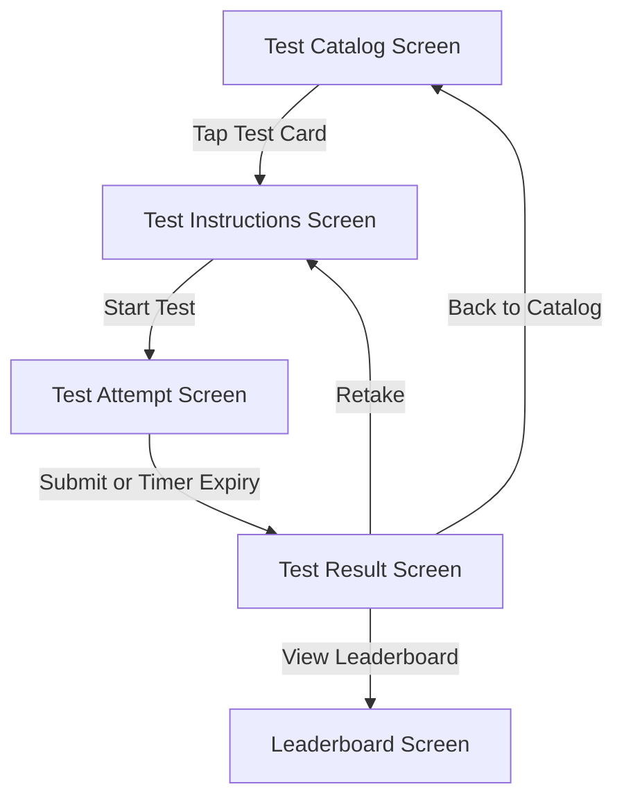
```mermaid
flowchart TD
    A[Test Catalog Screen] -->|Tap Test Card| B[Test Instructions Screen]
    B -->|Start Test| C[Test Attempt Screen]
    C -->|Submit or Timer Expiry| D[Test Result Screen]
    D -->|Retake| B
    D -->|View Leaderboard| E[Leaderboard Screen]
    D -->|Back to Catalog| A
```

---

# MODULE 14 — COURSES

## Screen: Course Catalog Screen
**Purpose:** Browse purchasable/enrollable courses (professional development).

**Fields:**
| Field | Type |
|---|---|
| Category Filter | Tabs/Dropdown |
| Search Bar | Text input |
| Course Card (repeated) | Display: Thumbnail, Title, Instructor, Price, Rating |

**Buttons:**
| Button | Action |
|---|---|
| Course Card (tap) | → **Course Detail Screen** |
| Bottom Nav | → switches root tab |

**API:** `GET /courses`

---

## Screen: Course Detail Screen
**Purpose:** Course info and purchase/enroll entry.

**Fields (Display):**
- Title, Description, Curriculum/Modules list, Instructor info, Reviews, Price, Duration

**Buttons:**
| Button | Action |
|---|---|
| "Enroll Now" (paid) | → **Payment Checkout Screen** → on success → **Course Player Screen** |
| "Enroll Free" (if free) | → API `POST /course-enrollments` → **Course Player Screen** |
| "Add to Wishlist" | → toggles saved state |
| Back arrow | → **Course Catalog Screen** |

---

## Screen: Course Player Screen
**Purpose:** Video lesson playback and progress tracking.

**Fields:**
| Field | Type |
|---|---|
| Video Player | Streaming video (S3-hosted) |
| Module/Lesson List (sidebar/accordion) | Navigation list with completion checkmarks |
| Notes section | Textarea (personal notes per lesson) |

**Buttons:**
| Button | Action |
|---|---|
| Lesson item (tap) | → loads that lesson's video |
| "Mark as Complete" | → updates progress → unlocks next lesson |
| "Take Assessment" (after final lesson) | → **Test Attempt Screen** (course-linked assessment) |
| "Download Certificate" (after 100% completion + passing assessment) | → **Certificate Screen** |
| Back arrow | → **Course Catalog Screen** |

**API:** `GET /course-enrollments/:id/progress`, `PATCH /course-enrollments/:id/progress`

---

## Screen: Certificate Screen
**Purpose:** View/download completion certificate.

**Fields (Display):** Certificate preview (Name, Course, Date, Certificate ID)

**Buttons:**
| Button | Action |
|---|---|
| "Download PDF" | → device download |
| "Share to Portfolio" | → adds to **Public Portfolio Screen** certificates section |
| "Share" | → device share sheet |
| Back arrow | → **Course Player Screen** |

---

### Module 14 Flow Diagram

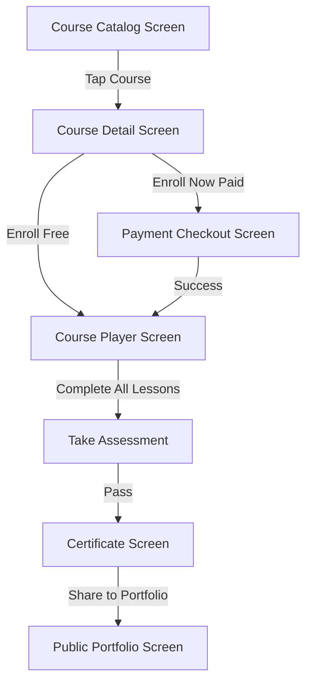
```mermaid
flowchart TD
    A[Course Catalog Screen] -->|Tap Course| B[Course Detail Screen]
    B -->|Enroll Free| C[Course Player Screen]
    B -->|Enroll Now Paid| D[Payment Checkout Screen]
    D -->|Success| C
    C -->|Complete All Lessons| E[Take Assessment]
    E -->|Pass| F[Certificate Screen]
    F -->|Share to Portfolio| G[Public Portfolio Screen]
```

---

# MODULE 15 — ANALYTICS

## Screen: Teacher Analytics Dashboard
**Purpose:** Personal performance insights.

**Fields (Display):**
- Profile Views (graph over time)
- Application Success Rate (%)
- AI Interview avg score trend
- Gig Earnings summary (graph)
- Course completion stats
- Skill Test performance trend

**Buttons:**
| Button | Action |
|---|---|
| Date range selector | → refreshes charts |
| "Export Report" (Premium feature) | → generates PDF |
| Tap any chart card | → drills into detail (e.g., tap "Applications" → **My Applications Screen**) |
| Bottom Nav | → switches root tab |

**API:** `GET /analytics/teacher/me`

---

# MODULE 16 — LEADERBOARD

## Screen: Leaderboard Screen
**Purpose:** Ranked teacher list by composite score.

**Fields:**
| Field | Type |
|---|---|
| Scope Filter | Tabs: Global / City / Subject |
| Time Filter | Dropdown: Weekly / Monthly / All-Time |
| Leaderboard Row (repeated) | Display: Rank, Photo, Name, Score, Badge icons |
| "Your Rank" sticky card | Display, highlights own position |

**Buttons:**
| Button | Action |
|---|---|
| Leaderboard Row (tap, other teacher) | → **Public Portfolio Screen** (their public profile) |
| Filter chips | → re-fetches list |
| Bottom Nav | → switches root tab |

**API:** `GET /leaderboards?scope=&period=`

---

# MODULE 17 — PORTFOLIO

## Screen: Public Portfolio Screen
**Purpose:** Shareable public-facing teacher profile (also visible to Parents/Schools).

**Fields (Display):**
- Profile photo, Name, Tagline, Profile Score badge
- Demo Videos (embedded players)
- Experience & Qualifications
- Reviews & Ratings
- Certificates & Badges
- Portfolio URL (e.g. scorten.com/p/teachername)

**Buttons:**
| Button | Action |
|---|---|
| "Share Portfolio" | → device share sheet with public URL |
| "Edit Portfolio Settings" (own profile only) | → **Portfolio Settings Screen** |
| "Message" (if viewed by school/parent) | → **Chat Conversation Screen** — not shown on own view |
| "Book a Session" (if viewed by parent, gig-linked) | → Parent app's booking flow |
| Back arrow | → previous screen (Leaderboard / Profile View / external link) |

---

## Screen: Portfolio Settings Screen
**Purpose:** Control visibility of portfolio sections.

**Fields:**
| Field | Type |
|---|---|
| Section Visibility Toggles (Videos / Reviews / Experience / Certificates) | Toggle switches |
| Custom URL slug | Text input, uniqueness validated |
| SEO Tagline | Text input |

**Buttons:**
| Button | Action |
|---|---|
| "Save" | → API `PATCH /teacher-profiles/:id/portfolio-settings` → **Public Portfolio Screen** |
| Back arrow | → **Public Portfolio Screen** |

---

### Module 17 Flow Diagram

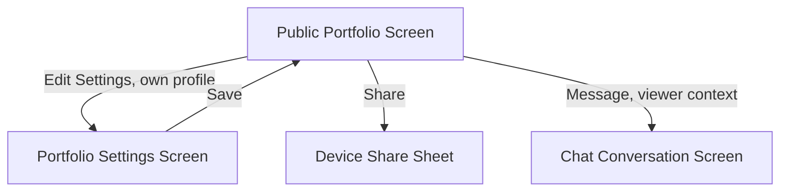
```mermaid
flowchart TD
    A[Public Portfolio Screen] -->|Edit Settings, own profile| B[Portfolio Settings Screen]
    B -->|Save| A
    A -->|Share| C[Device Share Sheet]
    A -->|Message, viewer context| D[Chat Conversation Screen]
```

---

# MODULE 18 — AI CAREER COACH

## Screen: AI Coach Chat Screen
**Purpose:** Conversational AI guidance interface.

**Fields:**
| Field | Type |
|---|---|
| Chat input | Text input |
| Suggested prompt chips ("Suggest jobs for me", "Improve my resume", "What's my salary range?") | Tappable chips |

**Buttons:**
| Button | Action |
|---|---|
| "Send" | → AI response streams in |
| Suggested chip (tap) | → auto-sends that prompt |
| "View Career Insights" | → **Career Insights Screen** |
| Bottom Nav | → switches root tab |

**API:** `POST /ai-coach/chat`

---

## Screen: Career Insights Screen
**Purpose:** Structured AI-generated career data (vs. freeform chat).

**Fields (Display):**
- Salary Benchmark for teacher's profile/location
- Recommended Courses (cards, → **Course Detail Screen**)
- Recommended Jobs (cards, → **Job Detail Screen**)
- Interview Tips (article-style list)

**Buttons:**
| Button | Action |
|---|---|
| Recommended Course Card | → **Course Detail Screen** |
| Recommended Job Card | → **Job Detail Screen** |
| "Ask Coach" (back to chat) | → **AI Coach Chat Screen** |
| Back arrow | → **Dashboard** |

---

### Module 18 Flow Diagram

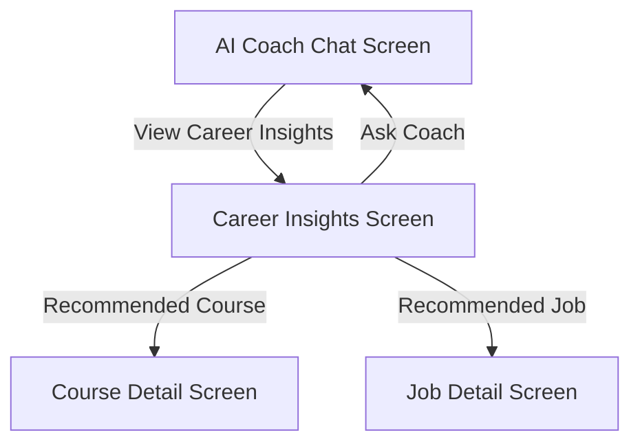
```mermaid
flowchart TD
    A[AI Coach Chat Screen] -->|View Career Insights| B[Career Insights Screen]
    B -->|Recommended Course| C[Course Detail Screen]
    B -->|Recommended Job| D[Job Detail Screen]
    B -->|Ask Coach| A
```

---

# MODULE 19 — SUPPORT

## Screen: Help Center Screen
**Purpose:** FAQ and ticket entry point.

**Fields:**
| Field | Type |
|---|---|
| Search FAQs | Text input |
| FAQ Categories (Account / Payments / Jobs / Interviews / Technical) | Expandable accordion list |

**Buttons:**
| Button | Action |
|---|---|
| FAQ item (tap) | → expands answer inline |
| "Raise a Ticket" | → **Raise Ticket Screen** |
| "Chat with Support" | → **Chat Conversation Screen** (support thread) |
| Back arrow | → **Settings Home** |

---

## Screen: Raise Ticket Screen
**Purpose:** Submit support request.

**Fields:**
| Field | Type | Validation |
|---|---|---|
| Category | Dropdown | Required |
| Subject | Text | Required |
| Description | Textarea | Required |
| Attach Screenshot | Image upload | Optional |

**Buttons:**
| Button | Action |
|---|---|
| "Submit Ticket" | → API `POST /tickets` → **Ticket Detail Screen** |
| Back arrow | → **Help Center Screen** |

---

## Screen: Ticket Detail Screen
**Purpose:** Track ticket status/conversation with admin support.

**Fields (Display):** Ticket ID, Status (Open/In Progress/Resolved), Conversation thread

**Buttons:**
| Button | Action |
|---|---|
| Reply input + "Send" | → adds message to ticket thread |
| "Close Ticket" | → confirmation → status=Resolved |
| Back arrow | → **My Tickets List** (if exists) or **Help Center Screen** |

**API:** `GET /tickets/:id`, `PATCH /tickets/:id`

---

### Module 19 Flow Diagram

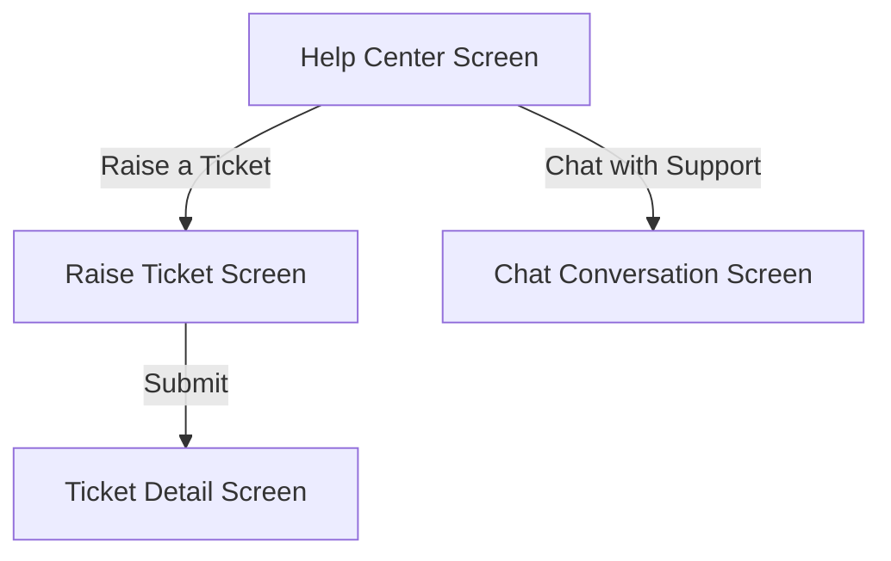
```mermaid
flowchart TD
    A[Help Center Screen] -->|Raise a Ticket| B[Raise Ticket Screen]
    B -->|Submit| C[Ticket Detail Screen]
    A -->|Chat with Support| D[Chat Conversation Screen]
```

---

# MODULE 20 — SETTINGS

## Screen: Settings Home Screen
**Purpose:** Central settings hub.

**Fields:** None (navigation list)

**Buttons:**
| Button | Action |
|---|---|
| "Account Settings" | → **Account Settings Screen** |
| "Notification Settings" | → **Notification Settings Screen** |
| "Privacy & Security" | → **Privacy Screen** |
| "Language" | → **Language Screen** |
| "Subscription Plans" | → **Subscription Plans Screen** (Module 11) |
| "Help & Support" | → **Help Center Screen** (Module 19) |
| "Logout" | → confirmation modal → clears token → **Welcome Screen** |
| "Delete Account" | → confirmation + reason form → API `DELETE /users/:id` → **Welcome Screen** |

---

## Screen: Account Settings Screen
**Fields:**
| Field | Type |
|---|---|
| Email (change) | Text input + OTP verify flow |
| Mobile Number (change) | Text input + OTP verify flow |
| Change Password | Current/New/Confirm password fields |

**Buttons:**
| Button | Action |
|---|---|
| "Update Email" / "Update Mobile" | → triggers OTP re-verification → **OTP Verification Screen** |
| "Change Password" | → API `PATCH /users/:id/password` → success toast |
| Back arrow | → **Settings Home Screen** |

---

## Screen: Notification Settings Screen
**Fields:**
| Field | Type |
|---|---|
| Push Notifications toggle (per category: Job Match/Interview/Offer/Payment/Gig/Course) | Toggle switches |
| Email Notifications toggle | Toggle switches |
| SMS Notifications toggle | Toggle switches |

**Buttons:**
| Button | Action |
|---|---|
| Toggles auto-save on change | → API `PATCH /users/:id/notification-prefs` |
| Back arrow | → **Settings Home Screen** |

---

## Screen: Privacy & Security Screen
**Fields:**
| Field | Type |
|---|---|
| Profile Visibility (Public/Schools Only/Private) | Radio |
| Two-Factor Authentication | Toggle |
| Blocked Users list | List with "Unblock" actions |

**Buttons:**
| Button | Action |
|---|---|
| "Save" | → API `PATCH /users/:id/privacy` |
| Back arrow | → **Settings Home Screen** |

---

## Screen: Language Screen
**Fields:** Language radio list (English/Hindi/Gujarati/etc.)

**Buttons:**
| Button | Action |
|---|---|
| Language selection (tap) | → applies immediately, app re-renders in selected language |
| Back arrow | → **Settings Home Screen** |

---

### Module 20 Flow Diagram

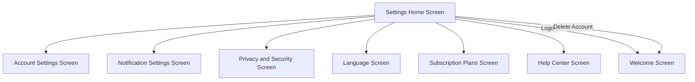
```mermaid
flowchart TD
    A[Settings Home Screen] --> B[Account Settings Screen]
    A --> C[Notification Settings Screen]
    A --> D[Privacy and Security Screen]
    A --> E[Language Screen]
    A --> F[Subscription Plans Screen]
    A --> G[Help Center Screen]
    A -->|Logout| H[Welcome Screen]
    A -->|Delete Account| H
```

---

# DASHBOARD (HOME) — ROOT SCREEN

## Screen: Dashboard Screen
**Purpose:** Post-login home hub — bottom nav root tab.

**Fields (Display):**
- Profile Score widget (mini gauge)
- AI-Recommended Jobs carousel
- Application status summary cards
- Wallet balance chip
- Quick links: Skill Tests, Courses, Gigs, Leaderboard
- Notifications bell (badge count)

**Buttons:**
| Button | Action |
|---|---|
| Profile Score widget | → **Profile View Screen** |
| Job carousel card | → **Job Detail Screen** |
| Application summary card | → **My Applications Screen** |
| Wallet chip | → **Wallet Home Screen** |
| Quick link tiles | → respective module home screen |
| Notification bell | → **Notifications List Screen** (in-app notification center) |
| Bottom Nav: Home / Jobs / Messages / Profile / More | → switches root tab |

**Bottom Navigation Tabs (Global, persists across app):**
1. **Home** → Dashboard Screen
2. **Jobs** → Job Feed Screen
3. **Messages** → Chat List Screen
4. **Wallet/Gigs** → Wallet Home Screen or My Gigs Screen (configurable)
5. **Profile** → Profile View Screen

---

## Screen: Notifications List Screen
**Purpose:** Centralized notification feed.

**Fields:** Notification Card (repeated) — icon by type, message, timestamp, read/unread state

**Buttons:**
| Button | Action |
|---|---|
| Notification Card (tap) | → deep-links to relevant screen (Job Match → Job Detail; Interview → Interview Schedule; Offer → Offer Detail; Payment → Transaction History; Gig Booking → Gig Bookings; Course Updates → Course Player) |
| "Mark all as read" | → updates state |
| Back arrow | → **Dashboard Screen** |

---

# TEACHER APP — MASTER NAVIGATION FLOW

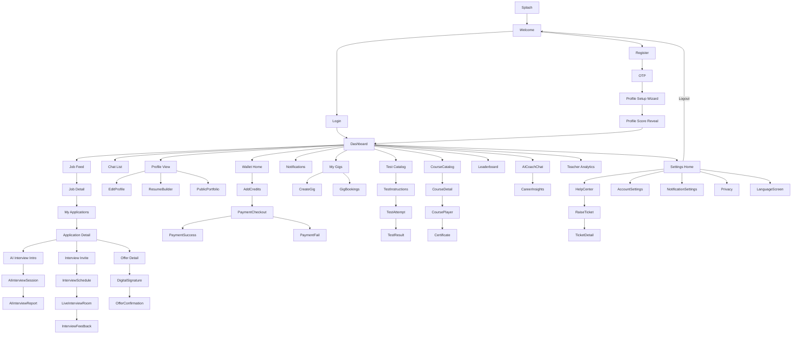
```mermaid
flowchart TD
    Splash --> Welcome
    Welcome --> Login
    Welcome --> Register
    Register --> OTP
    OTP --> ProfileSetup[Profile Setup Wizard]
    Login --> Dashboard
    ProfileSetup --> ScoreReveal[Profile Score Reveal]
    ScoreReveal --> Dashboard

    Dashboard --> JobFeed[Job Feed]
    Dashboard --> ChatList[Chat List]
    Dashboard --> ProfileView[Profile View]
    Dashboard --> Wallet[Wallet Home]
    Dashboard --> Notifications

    JobFeed --> JobDetail[Job Detail]
    JobDetail --> Applications[My Applications]
    Applications --> AppDetail[Application Detail]
    AppDetail --> AIInterviewIntro[AI Interview Intro]
    AIInterviewIntro --> AIInterviewSession --> AIInterviewReport
    AppDetail --> InterviewInvite[Interview Invite]
    InterviewInvite --> InterviewSchedule --> LiveInterviewRoom --> InterviewFeedback
    AppDetail --> OfferDetail[Offer Detail]
    OfferDetail --> DigitalSignature --> OfferConfirmation

    ProfileView --> EditProfile
    ProfileView --> ResumeBuilder
    ProfileView --> PublicPortfolio

    Wallet --> AddCredits --> PaymentCheckout
    PaymentCheckout --> PaymentSuccess
    PaymentCheckout --> PaymentFail

    Dashboard --> MyGigs[My Gigs]
    MyGigs --> CreateGig
    MyGigs --> GigBookings

    Dashboard --> TestCatalog[Test Catalog]
    TestCatalog --> TestInstructions --> TestAttempt --> TestResult

    Dashboard --> CourseCatalog
    CourseCatalog --> CourseDetail --> CoursePlayer --> Certificate

    Dashboard --> Leaderboard
    Dashboard --> AICoachChat --> CareerInsights
    Dashboard --> AnalyticsDashboard[Teacher Analytics]

    Dashboard --> SettingsHome[Settings Home]
    SettingsHome --> HelpCenter --> RaiseTicket --> TicketDetail
    SettingsHome --> AccountSettings
    SettingsHome --> NotificationSettings
    SettingsHome --> Privacy
    SettingsHome --> LanguageScreen
    SettingsHome -->|Logout| Welcome
```

---

**END OF TEACHER APP DOCUMENTATION**
