# SCORTEN — SCHOOL APP
## Complete Screen-by-Screen Documentation

---

## INDEX

| Module | Screens |
|---|---|
| 01 Authentication | Splash, Welcome, Login, Register, OTP Verify, Forgot/Reset Password |
| 02 School Profile | Profile Setup Wizard (4 steps), Profile View, Edit Profile, Branch/Multi-Location |
| 03 Job Posting | Job List, Create/Edit Job, Job Detail (School View) |
| 04 Teacher Search | Search/Discovery, Teacher Profile View (School View), Saved Teachers |
| 05 Applicant Management | Applicants List (per job), Applicant Detail, Bulk Shortlist |
| 06 AI Interview Setup | AI Screening Settings, AI Interview Results Review |
| 07 Interview Scheduling | Schedule Interview, Interview Calendar, Live Interview Room (School Side) |
| 08 Offer Management | Create Offer, Offers Sent List, Offer Status Tracking |
| 09 Messaging | Chat List, Chat Conversation |
| 10 Payments & Subscription | Subscription Plans, Payment Checkout, Billing History |
| 11 Analytics | Hiring Analytics Dashboard |
| 12 Team Management | Team Members List, Invite Member, Role Permissions |
| 13 Support | Help Center, Raise Ticket, Ticket Detail |
| 14 Settings | Settings Home, Account Settings, Notification Settings, Privacy |

---

# MODULE 01 — AUTHENTICATION

## Screen: Splash Screen
**Purpose:** App load / token check.

**Fields:** None

**Buttons:** None (auto-redirect ~2s)

**Navigation Logic:**
- Valid token → **Dashboard**
- No token → **Welcome Screen**

**API:** `GET /auth/verify-token`

---

## Screen: Welcome Screen
**Purpose:** Entry point for school admins/HR.

**Fields:** None

**Buttons:**
| Button | Action |
|---|---|
| "I'm a School" | → confirms role context = school → **Login Screen** |
| "Login" | → **Login Screen** |
| "Register Your School" | → **Register Screen** |

---

## Screen: Login Screen
**Purpose:** Existing school account login.

**Fields:**
| Field | Type | Validation |
|---|---|---|
| Email / Mobile | Text input | Required |
| Password | Password (masked) | Required |

**Buttons:**
| Button | Action |
|---|---|
| "Login" | → API `POST /auth/login` → success + profile incomplete → **Profile Setup Wizard**; success + complete → **Dashboard** |
| "Forgot Password?" | → **Forgot Password Screen** |
| "Register Your School" (link) | → **Register Screen** |

**API:** `POST /auth/login`

---

## Screen: Register Screen
**Purpose:** New school account + organization creation.

**Fields:**
| Field | Type | Validation |
|---|---|---|
| School/Institute Name | Text | Required |
| Admin Full Name | Text | Required |
| Official Email | Email | Required, unique |
| Mobile Number | Numeric | Required, unique |
| Password | Password (masked) | Min 8 chars, 1 number, 1 special char |
| Confirm Password | Password (masked) | Must match |
| Terms & Privacy Checkbox | Checkbox | Required |

**Buttons:**
| Button | Action |
|---|---|
| "Create School Account" | → API `POST /auth/register` (role=school) → **OTP Verification Screen** |
| "Already registered? Login" | → **Login Screen** |

**API:** `POST /auth/register`

---

## Screen: OTP Verification Screen
**Purpose:** Verify email/mobile.

**Fields:**
| Field | Type | Validation |
|---|---|---|
| OTP Code | 6-digit input | Required, 5 min expiry |

**Buttons:**
| Button | Action |
|---|---|
| "Verify" | → API `POST /auth/verify-otp` → **Profile Setup Wizard Step 1** |
| "Resend OTP" | → 30s cooldown → re-triggers send |

**API:** `POST /auth/verify-otp`

---

## Screen: Forgot Password Screen / Reset Password Screen
Same structure as Teacher App (Module 01) — Email/Mobile entry → OTP → New Password.

**APIs:** `POST /auth/forgot-password`, `POST /auth/reset-password`

---

### Module 01 Flow Diagram

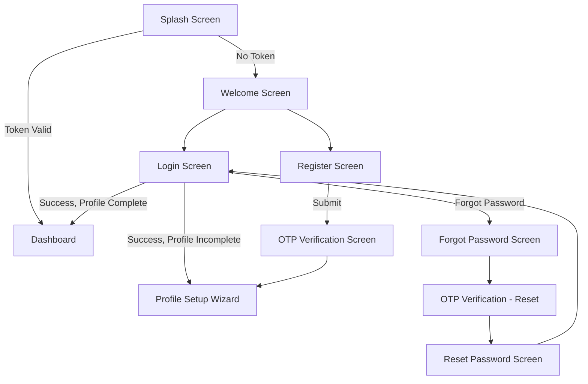

---

# MODULE 02 — SCHOOL PROFILE

## Screen: Profile Setup Wizard

### Step 1: Institute Details
**Fields:**
| Field | Type | Validation |
|---|---|---|
| School Logo | Image upload | Optional |
| School Name | Text | Pre-filled, editable |
| School Type | Dropdown (Private/Government/International/Coaching Institute) | Required |
| Board(s) Affiliated | Multi-select (CBSE/ICSE/IB/State/IGCSE) | Required |
| Established Year | Numeric/Year picker | Required |
| Website (if any) | Text/URL | Optional |

**Buttons:**
| Button | Action |
|---|---|
| "Next" | → **Step 2: Location & Contact** |
| "Skip for Now" | → **Dashboard** (incomplete banner) |

---

### Step 2: Location & Contact
**Fields:**
| Field | Type | Validation |
|---|---|---|
| Address | Text/Autocomplete | Required |
| City | Text | Required |
| State | Dropdown | Required |
| Pin Code | Numeric | Required |
| Contact Person Name | Text | Required |
| Contact Designation | Text | Required |
| Alternate Contact Number | Numeric | Optional |

**Buttons:**
| Button | Action |
|---|---|
| "Back" | → **Step 1** |
| "Next" | → **Step 3: Verification Documents** |

---

### Step 3: Verification Documents
**Fields:**
| Field | Type | Validation |
|---|---|---|
| School Registration Certificate | File upload | Required, PDF/Image |
| Affiliation Certificate | File upload | Required |
| GST/PAN (if applicable) | File upload | Optional |
| Authorized Signatory ID Proof | File upload | Required |

**Buttons:**
| Button | Action |
|---|---|
| "Back" | → **Step 2** |
| "Next" | → **Step 4: Hiring Preferences** |

**API:** Files via signed S3 URL → `POST /school-profiles/:id/documents`

---

### Step 4: Hiring Preferences
**Fields:**
| Field | Type |
|---|---|
| Subjects Typically Hiring For | Multi-select |
| Grade Levels | Multi-select |
| Average Hiring Volume per Year | Dropdown (1-5 / 6-20 / 21-50 / 50+) |
| Preferred Interview Mode | Radio (AI Screening First / Direct Human Interview / Both) |

**Buttons:**
| Button | Action |
|---|---|
| "Back" | → **Step 3** |
| "Finish Setup" | → API `POST /school-profiles/:id/complete` → **Verification Pending Screen** |

---

## Screen: Verification Pending Screen
**Purpose:** Holding screen while Admin verifies submitted documents.

**Fields (Display):** Status message ("Your school is under verification, typically takes 24-48 hrs"), submitted document checklist with status icons

**Buttons:**
| Button | Action |
|---|---|
| "Go to Dashboard" | → **Dashboard** (limited features until verified — Job Posting disabled with banner) |
| "Contact Support" | → **Raise Ticket Screen** |

**Navigation Logic:** Admin action (`PATCH /school-profiles/:id/verify`) triggers push notification → unlocks full Dashboard features.

---

## Screen: Profile View Screen
**Purpose:** School's own full profile (also visible publicly to Teachers).

**Fields (Display):** Logo, Name, Type, Board affiliations, Location, Verified Badge, About section, Open Jobs count, Rating (from teacher reviews)

**Buttons:**
| Button | Action |
|---|---|
| "Edit Profile" | → **Edit Profile Screen** |
| "Manage Branches" (if multi-location) | → **Branch/Multi-Location Screen** |
| "View as Teachers See It" | → preview mode (read-only render) |
| Back arrow | → **Dashboard** |

---

## Screen: Edit Profile Screen
**Fields:** Same as Wizard Steps 1-2, tabbed: Institute Details | Location & Contact | Documents

**Buttons:**
| Button | Action |
|---|---|
| "Save Changes" | → API `PATCH /school-profiles/:id` → **Profile View Screen** |
| "Cancel" | → **Profile View Screen** |

---

## Screen: Branch/Multi-Location Screen
**Purpose:** For school groups with multiple campuses.

**Fields:**
| Field | Type |
|---|---|
| Branch Card (repeated) | Display: Branch Name, Address, Active Jobs count |

**Buttons:**
| Button | Action |
|---|---|
| "+ Add Branch" | → opens form (Name, Address, Contact) → API `POST /school-profiles/:id/branches` |
| Branch Card (tap) | → filters Dashboard/Jobs to that branch context |
| Back arrow | → **Profile View Screen** |

---

### Module 02 Flow Diagram

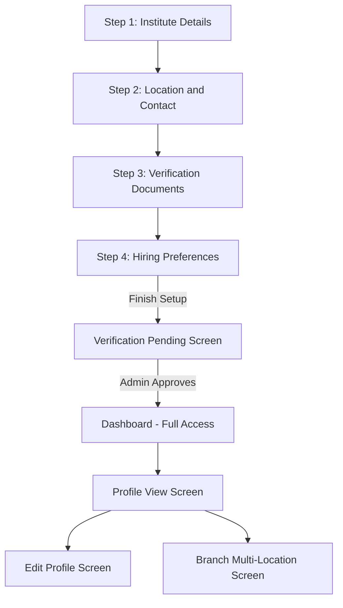

---

# MODULE 03 — JOB POSTING

## Screen: Job List Screen (School View)
**Purpose:** Manage all posted jobs.

**Fields:**
| Field | Type |
|---|---|
| Status Tabs | All / Open / Paused / Closed / Expired |
| Job Card (repeated) | Display: Title, Subject, Applicants count, Status, Posted date |

**Buttons:**
| Button | Action |
|---|---|
| "+ Post New Job" | → **Create Job Screen** |
| Job Card (tap) | → **Job Detail Screen (School View)** |
| Bottom Nav: Home / Jobs / Applicants / Messages / Profile | → switches root tab |

**API:** `GET /jobs?school_id=me`

---

## Screen: Create/Edit Job Screen
**Purpose:** Post or edit a job listing.

**Fields:**
| Field | Type | Validation |
|---|---|---|
| Job Title | Text | Required |
| Subject | Dropdown/Multi-select | Required |
| Grade Level | Multi-select | Required |
| Board | Multi-select | Required |
| Job Type | Radio (Full-time/Part-time/Freelance) | Required |
| Mode | Radio (Online/Offline/Hybrid) | Required |
| Location/Branch | Dropdown (if multi-branch) | Required |
| Salary Range | Min/Max numeric fields | Required |
| Requirements | Textarea / bullet list builder | Required |
| Job Description | Rich text editor | Required |
| Application Deadline | Date picker | Required |
| Enable AI Screening | Toggle | Default ON |
| Number of Openings | Numeric | Required |

**Buttons:**
| Button | Action |
|---|---|
| "Save as Draft" | → API `POST /jobs` (status=draft, not publicly visible) |
| "Publish Job" | → API `POST /jobs` (status=Open) → **Job Detail Screen (School View)** |
| "Preview" | → shows Teacher-side **Job Detail Screen** as preview modal |
| Back arrow | → **Job List Screen** (discard prompt if dirty) |

**Navigation Logic:** If school not yet verified → "Publish Job" disabled, shows "Pending Verification" tooltip.

---

## Screen: Job Detail Screen (School View)
**Purpose:** Manage a specific live job posting.

**Fields (Display):** Full job details, Applicant funnel summary (Applied → Shortlisted → Interview → Offer → Hired counts)

**Buttons:**
| Button | Action |
|---|---|
| "View Applicants" | → **Applicants List Screen** (filtered to this job) |
| "Edit Job" | → **Create/Edit Job Screen** (pre-filled) |
| "Pause Job" / "Reopen Job" | → API `PATCH /jobs/:id` (status toggle) |
| "Close Job" | → confirmation modal → API `PATCH /jobs/:id` (status=Closed) |
| "Duplicate Job" | → **Create/Edit Job Screen** pre-filled as new draft |
| Back arrow | → **Job List Screen** |

**API:** `GET /jobs/:id`, `PATCH /jobs/:id`

---

### Module 03 Flow Diagram

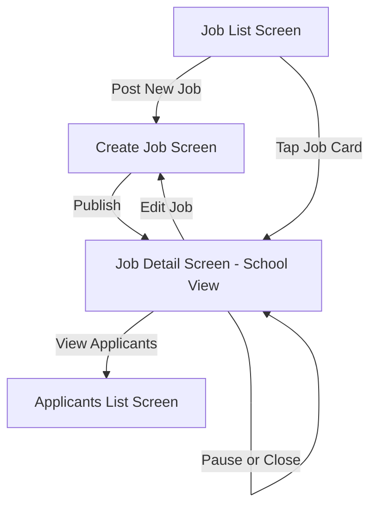

---

# MODULE 04 — TEACHER SEARCH

## Screen: Search/Discovery Screen
**Purpose:** Proactively search teacher database (vs. waiting for applications).

**Fields:**
| Field | Type |
|---|---|
| Search Bar | Text (name/subject/keyword) |
| Filters: Subject, Location, Experience range, Qualification, Min Profile Score, Availability | Filter panel (collapsible) |
| Teacher Card (repeated) | Display: Photo, Name, Subjects, Experience, Profile Score, Rating |

**Buttons:**
| Button | Action |
|---|---|
| Teacher Card (tap) | → **Teacher Profile View Screen (School View)** |
| "Save" icon (per card) | → adds to **Saved Teachers Screen** |
| "Invite to Apply" (per card) | → sends job invite notification → modal to select which job |
| Bottom Nav | → switches root tab |

**API:** `GET /teacher-profiles/search`

---

## Screen: Teacher Profile View Screen (School View)
**Purpose:** Full teacher profile as seen by hiring schools.

**Fields (Display):** Same data as Teacher's own Profile View — Personal Info, Teaching Info, Experience, Qualifications, Documents (verification status visible), Demo Videos, AI Profile Score breakdown, Skill Test results, Reviews/Ratings, AI Interview reports (if completed/shared)

**Buttons:**
| Button | Action |
|---|---|
| "Invite to Apply" | → select job modal → sends invite |
| "Shortlist" (if already applied to one of school's jobs) | → updates application status |
| "Message" | → **Chat Conversation Screen** |
| "Save to List" | → **Saved Teachers Screen** |
| "View Demo Video" (inline player) | → plays video in modal |
| Back arrow | → **Search/Discovery Screen** or **Applicants List Screen** (context-dependent) |

---

## Screen: Saved Teachers Screen
**Purpose:** Shortlist/wishlist of interesting candidates not yet formally engaged.

**Fields:** Saved Teacher Card (repeated) — Photo, Name, Subject, Saved date

**Buttons:**
| Button | Action |
|---|---|
| Card (tap) | → **Teacher Profile View Screen** |
| "Remove" | → removes from list |
| "Invite to Apply" | → select job modal |
| Back arrow | → **Search/Discovery Screen** |

---

### Module 04 Flow Diagram

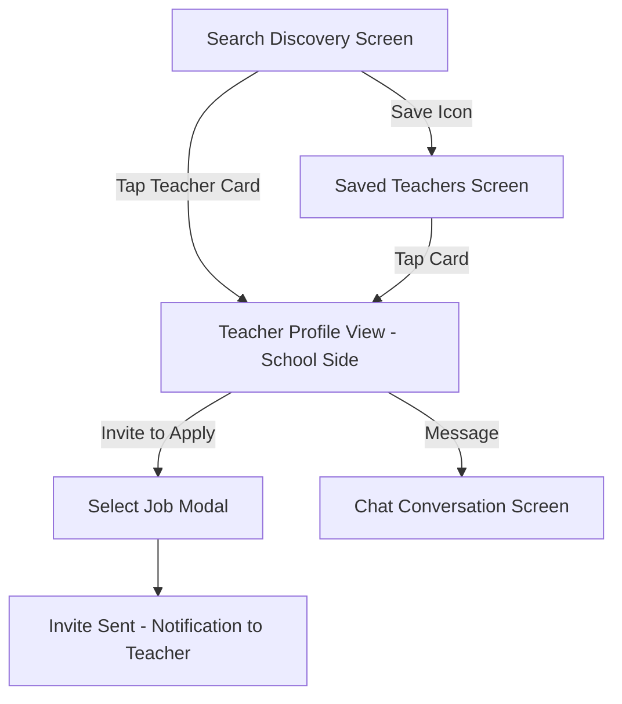

---

# MODULE 05 — APPLICANT MANAGEMENT

## Screen: Applicants List Screen
**Purpose:** Pipeline view of all applicants for a job (or all jobs combined).

**Fields:**
| Field | Type |
|---|---|
| Job Filter (if viewing all) | Dropdown |
| Status Pipeline Tabs | Applied / AI Screened / Shortlisted / Interview Scheduled / Interview Completed / Offer Sent / Hired / Rejected |
| Sort | Dropdown: AI Match Score / Application Date / Profile Score |
| Applicant Card (repeated) | Display: Photo, Name, AI Match %, Profile Score, Status badge |
| Checkbox (per card, for bulk actions) | Checkbox |

**Buttons:**
| Button | Action |
|---|---|
| Applicant Card (tap) | → **Applicant Detail Screen** |
| "Bulk Shortlist" (when checkboxes selected) | → **Bulk Shortlist Confirmation Screen/Modal** |
| "Bulk Reject" (when checkboxes selected) | → confirmation modal → updates statuses |
| Back arrow | → **Job Detail Screen** |

**API:** `GET /applications?job_id=:id`

---

## Screen: Applicant Detail Screen
**Purpose:** Full applicant review and action center.

**Fields (Display):** Teacher profile summary, Application-specific data (cover note if any), AI Screening Report summary (if completed), Status timeline

**Buttons:**
| Button | Action |
|---|---|
| "View Full Profile" | → **Teacher Profile View Screen (School View)** |
| "View AI Interview Report" | → **AI Interview Results Review Screen** |
| "Shortlist" | → API `PATCH /applications/:id` (status=Shortlisted) |
| "Schedule Interview" | → **Schedule Interview Screen** |
| "Send Offer" | → **Create Offer Screen** |
| "Reject" | → confirmation modal (optional reason/feedback) → status update, teacher notified |
| "Message Teacher" | → **Chat Conversation Screen** |
| Back arrow | → **Applicants List Screen** |

---

## Screen: Bulk Shortlist Confirmation Screen/Modal
**Purpose:** Confirm batch status change.

**Fields (Display):** List of selected applicant names, target status

**Buttons:**
| Button | Action |
|---|---|
| "Confirm" | → API `PATCH /applications/bulk` → **Applicants List Screen** (updated) |
| "Cancel" | → **Applicants List Screen** |

---

### Module 05 Flow Diagram

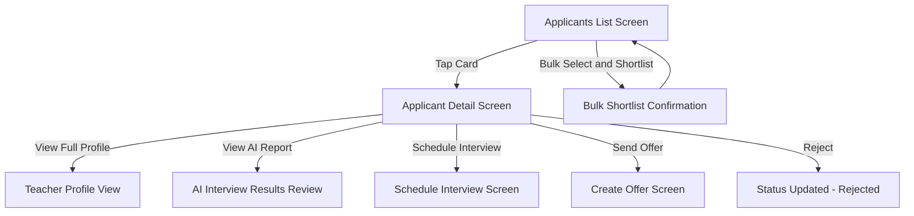

---

# MODULE 06 — AI INTERVIEW SETUP

## Screen: AI Screening Settings Screen
**Purpose:** Configure AI screening parameters per job.

**Fields:**
| Field | Type |
|---|---|
| Enable AI Screening | Toggle |
| Question Focus Areas | Multi-select (Subject Knowledge/Communication/Classroom Management/Behavioral) |
| Minimum Passing Score | Numeric/slider |
| Auto-Shortlist if Score Above Threshold | Toggle + numeric threshold |
| Auto-Reject if Score Below Threshold | Toggle + numeric threshold |

**Buttons:**
| Button | Action |
|---|---|
| "Save Settings" | → API `PATCH /jobs/:id/ai-settings` → **Job Detail Screen** |
| Back arrow | → **Job Detail Screen** |

---

## Screen: AI Interview Results Review Screen
**Purpose:** School reviews a candidate's AI interview report in depth.

**Fields (Display):**
- Overall Score, breakdown (Communication, Confidence, Subject Knowledge, Teaching Ability, Behavioral)
- Video playback of interview segments
- AI-generated written summary/recommendation
- Comparison against job's minimum threshold

**Buttons:**
| Button | Action |
|---|---|
| "Play Segment" (per question) | → inline video playback |
| "Shortlist Candidate" | → updates application status |
| "Reject Candidate" | → updates application status |
| "Schedule Human Interview" | → **Schedule Interview Screen** |
| Back arrow | → **Applicant Detail Screen** |

**API:** `GET /ai-interviews/:id/report`

---

### Module 06 Flow Diagram

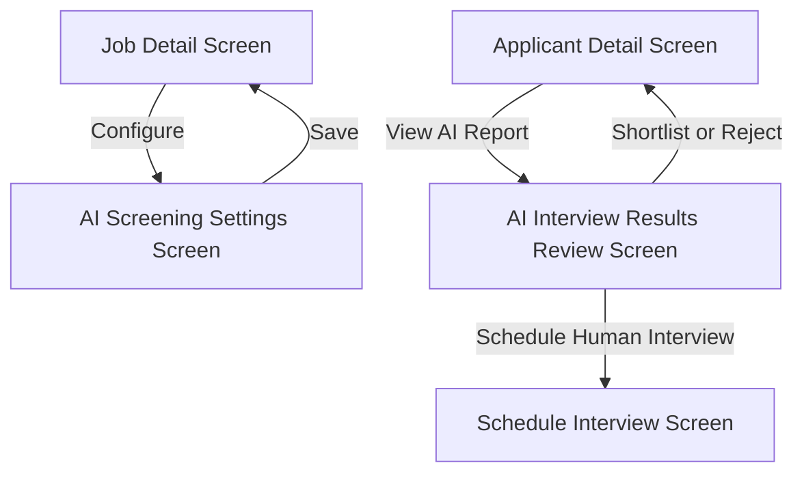

---

# MODULE 07 — INTERVIEW SCHEDULING

## Screen: Schedule Interview Screen
**Purpose:** Propose interview slot(s) to a candidate.

**Fields:**
| Field | Type | Validation |
|---|---|---|
| Interview Mode | Radio (Video Call/In-Person) | Required |
| Date | Date picker | Required, future date |
| Time | Time picker | Required |
| Alternate Slots (optional) | Add up to 2 more date/time pairs | Optional |
| Location (if In-Person) | Text/Address | Required if In-Person |
| Interviewer(s) | Multi-select from Team Members | Required |
| Notes for Candidate | Textarea | Optional |

**Buttons:**
| Button | Action |
|---|---|
| "+ Add Alternate Slot" | → adds another date/time field set |
| "Send Invite" | → API `POST /interviews` → invite sent to teacher → **Interview Calendar Screen** |
| Back arrow | → **Applicant Detail Screen** |

---

## Screen: Interview Calendar Screen
**Purpose:** School's master calendar of all scheduled interviews.

**Fields:**
| Field | Type |
|---|---|
| Calendar View (Month/Week/Day toggle) | Calendar widget |
| Interview Event blocks (per scheduled interview) | Display: Candidate name, Job, Time |

**Buttons:**
| Button | Action |
|---|---|
| Event block (tap) | → **Applicant Detail Screen** or quick-view modal (Reschedule/Cancel/Join) |
| "Join Video Call" (active in window) | → **Live Interview Room Screen (School Side)** |
| Bottom Nav | → switches root tab |

**API:** `GET /interviews?school_id=me`

---

## Screen: Live Interview Room Screen (School Side)
**Purpose:** Conduct video interview (Agora/100ms).

**Fields:**
| Field | Type |
|---|---|
| Video feed grid (interviewer(s) + candidate) | Live video |
| Scoring/Notes panel (sidebar) | Textarea + star ratings per competency, filled live during call |

**Buttons:**
| Button | Action |
|---|---|
| Mute/Unmute, Camera On/Off | Toggles |
| "Submit Interview Notes" | → saves notes/scores → enabled during or post-call |
| "Leave Call" | → confirmation → **Applicant Detail Screen** (with prompt to finalize decision: Shortlist/Offer/Reject) |

**API:** `POST /interviews/:id/join`, `POST /interviews/:id/notes`

---

### Module 07 Flow Diagram

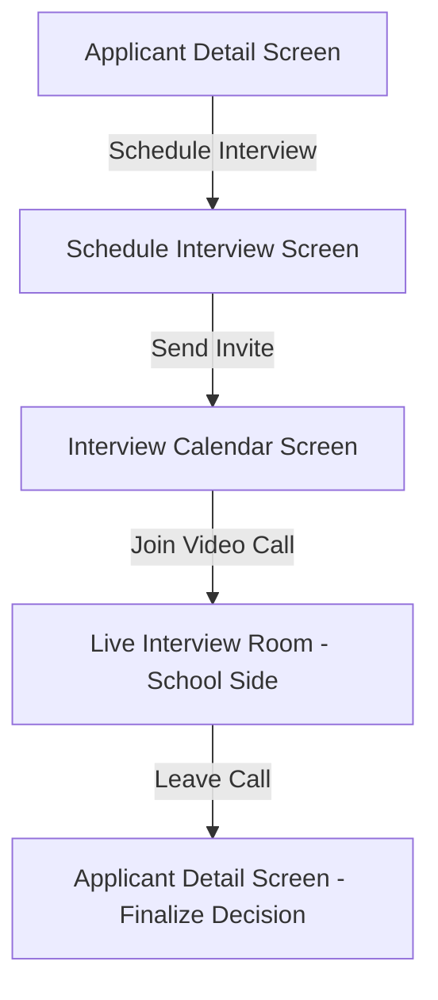

---

# MODULE 08 — OFFER MANAGEMENT

## Screen: Create Offer Screen
**Purpose:** Draft and send offer letter to a candidate.

**Fields:**
| Field | Type | Validation |
|---|---|---|
| Job Title / Designation | Text (pre-filled from job) | Required |
| Salary/CTC | Numeric breakdown fields | Required |
| Joining Date | Date picker | Required |
| Contract Type | Dropdown (Permanent/Probation/Contract) | Required |
| Terms & Conditions | Rich text / template selector | Required |
| Offer Validity (expiry) | Date picker | Required |

**Buttons:**
| Button | Action |
|---|---|
| "Preview Offer Letter" | → PDF preview modal |
| "Save as Draft" | → API `POST /offers` (status=Draft) |
| "Send Offer" | → API `POST /offers` (status=Sent) → teacher notified → **Offers Sent List Screen** |
| Back arrow | → **Applicant Detail Screen** |

---

## Screen: Offers Sent List Screen
**Purpose:** Track all offers sent by school.

**Fields:**
| Field | Type |
|---|---|
| Status Filter Tabs | Draft / Sent / Viewed / Accepted / Rejected / Expired |
| Offer Card (repeated) | Display: Candidate Name, Job, Salary, Status, Date Sent |

**Buttons:**
| Button | Action |
|---|---|
| Offer Card (tap) | → **Offer Status Tracking Screen** |
| Draft card → "Edit" | → **Create Offer Screen** (pre-filled) |
| Bottom Nav | → switches root tab |

**API:** `GET /offers?school_id=me`

---

## Screen: Offer Status Tracking Screen
**Purpose:** Detail/status view of a single sent offer.

**Fields (Display):** Offer terms, Status timeline (Sent → Viewed → Accepted/Rejected/Negotiating), Signed document (if accepted)

**Buttons:**
| Button | Action |
|---|---|
| "View Negotiation" (if candidate countered) | → shows counter-terms → "Accept Counter" / "Send Revised Offer" / "Decline" |
| "Resend Offer" (if expired) | → **Create Offer Screen** pre-filled |
| "Download Signed Copy" (if accepted) | → device download |
| "Message Candidate" | → **Chat Conversation Screen** |
| Back arrow | → **Offers Sent List Screen** |

---

### Module 08 Flow Diagram

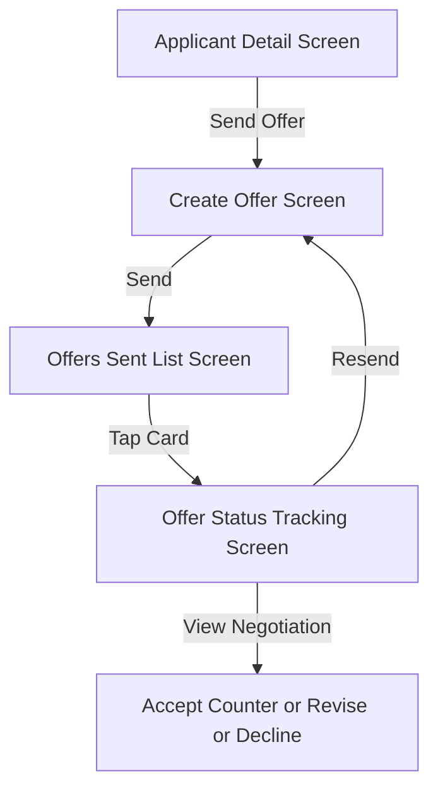

---

# MODULE 09 — MESSAGING

## Screen: Chat List Screen
Same structure as Teacher App Module 08 — conversations with Teachers (applicants/hired), Admin support.

**Buttons:**
| Button | Action |
|---|---|
| Conversation Card (tap) | → **Chat Conversation Screen** |
| Bottom Nav | → switches root tab |

---

## Screen: Chat Conversation Screen
Same structure as Teacher App — text, file, voice note messaging.

**Buttons:**
| Button | Action |
|---|---|
| "Send" | → posts message |
| Header → "View Application" | → **Applicant Detail Screen** |
| Back arrow | → **Chat List Screen** |

---

# MODULE 10 — PAYMENTS & SUBSCRIPTION

## Screen: Subscription Plans Screen
**Purpose:** School-tier plans (job posting limits, AI screening credits, search access tiers).

**Fields:**
| Field | Type |
|---|---|
| Plan Cards (Free/Growth/Enterprise) | Selectable, feature comparison table |
| Billing Cycle Toggle | Monthly/Yearly |

**Buttons:**
| Button | Action |
|---|---|
| "Choose Plan" | → **Payment Checkout Screen** |
| Back arrow | → **Settings Home Screen** |

---

## Screen: Payment Checkout Screen
Same structure as Teacher App — Razorpay integration.

**Buttons:**
| Button | Action |
|---|---|
| "Pay ₹[amount]" | → Razorpay SDK → success/fail screens |

---

## Screen: Billing History Screen
**Purpose:** Invoice/payment record.

**Fields:** Invoice Row (repeated) — Date, Plan/Item, Amount, Status

**Buttons:**
| Button | Action |
|---|---|
| "Download Invoice" (per row) | → PDF download |
| Back arrow | → **Settings Home Screen** |

---

### Module 10 Flow Diagram

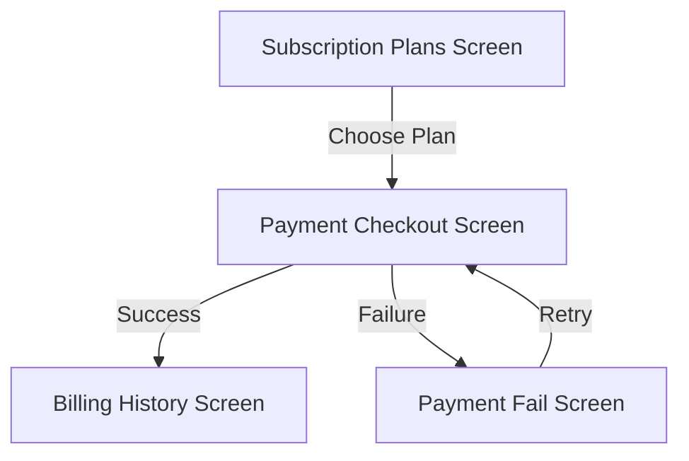

---

# MODULE 11 — ANALYTICS

## Screen: Hiring Analytics Dashboard
**Purpose:** Recruitment funnel and performance insights.

**Fields (Display):**
- Total Jobs Posted / Active
- Applicant funnel chart (Applied → Shortlisted → Interview → Offer → Hired) with drop-off %
- Time-to-Hire average
- AI Screening accuracy/usage stats
- Cost-per-Hire (if subscription/payment data tied in)
- Top-performing job posts

**Buttons:**
| Button | Action |
|---|---|
| Date range selector | → refreshes charts |
| Funnel stage (tap) | → **Applicants List Screen** filtered to that stage |
| "Export Report" | → PDF/CSV download |
| Bottom Nav | → switches root tab |

**API:** `GET /analytics/school/me`

---

# MODULE 12 — TEAM MANAGEMENT

## Screen: Team Members List Screen
**Purpose:** Manage HR staff/interviewers who have access to the School App account.

**Fields:** Member Card (repeated) — Name, Role (Admin/HR/Interviewer), Email, Status

**Buttons:**
| Button | Action |
|---|---|
| "+ Invite Member" | → **Invite Member Screen** |
| Member Card (tap) | → **Role Permissions Screen** (for that member) |
| "Remove" | → confirmation modal → revokes access |
| Back arrow | → **Settings Home Screen** |

---

## Screen: Invite Member Screen
**Fields:**
| Field | Type | Validation |
|---|---|---|
| Email | Email | Required |
| Role | Dropdown (Admin/HR/Interviewer) | Required |

**Buttons:**
| Button | Action |
|---|---|
| "Send Invite" | → API `POST /school-profiles/:id/team` → email invite sent → **Team Members List Screen** |
| Back arrow | → **Team Members List Screen** |

---

## Screen: Role Permissions Screen
**Fields:** Permission toggles (Post Jobs / View Applicants / Schedule Interviews / Send Offers / View Analytics / Manage Billing)

**Buttons:**
| Button | Action |
|---|---|
| "Save Permissions" | → API `PATCH /school-profiles/:id/team/:memberId` |
| Back arrow | → **Team Members List Screen** |

---

### Module 12 Flow Diagram

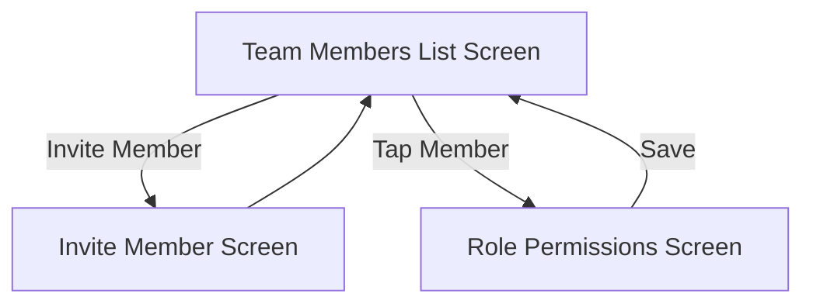

---

# MODULE 13 — SUPPORT

Same structure as Teacher App Module 19.

## Screen: Help Center Screen → Raise Ticket Screen → Ticket Detail Screen

**Buttons:**
| Button | Action |
|---|---|
| "Raise a Ticket" | → **Raise Ticket Screen** |
| "Submit Ticket" | → **Ticket Detail Screen** |
| "Chat with Support" | → **Chat Conversation Screen** |

---

# MODULE 14 — SETTINGS

## Screen: Settings Home Screen
**Buttons:**
| Button | Action |
|---|---|
| "Account Settings" | → **Account Settings Screen** |
| "Notification Settings" | → **Notification Settings Screen** |
| "Privacy & Security" | → **Privacy Screen** |
| "Team Management" | → **Team Members List Screen** (Module 12) |
| "Subscription & Billing" | → **Subscription Plans Screen** / **Billing History Screen** |
| "Help & Support" | → **Help Center Screen** |
| "Logout" | → confirmation → **Welcome Screen** |

(Account Settings, Notification Settings, Privacy sub-screens mirror Teacher App structure with school-relevant fields.)

---

# SCHOOL APP — DASHBOARD (HOME) ROOT SCREEN

## Screen: Dashboard Screen
**Fields (Display):**
- Verification status banner (if pending)
- Active Jobs summary (count, quick stats)
- New Applicants notification widget
- Upcoming Interviews widget (today/this week)
- AI Screening quick stats
- Quick Actions: Post New Job, Search Teachers, View Applicants

**Buttons:**
| Button | Action |
|---|---|
| "Post New Job" | → **Create Job Screen** |
| "Search Teachers" | → **Search/Discovery Screen** |
| Active Jobs widget | → **Job List Screen** |
| New Applicants widget | → **Applicants List Screen** |
| Upcoming Interviews widget | → **Interview Calendar Screen** |
| Notification bell | → **Notifications List Screen** |

**Bottom Navigation Tabs (Global):**
1. **Home** → Dashboard Screen
2. **Jobs** → Job List Screen
3. **Applicants** → Applicants List Screen (all jobs)
4. **Messages** → Chat List Screen
5. **Profile** → Profile View Screen

---

# SCHOOL APP — MASTER NAVIGATION FLOW

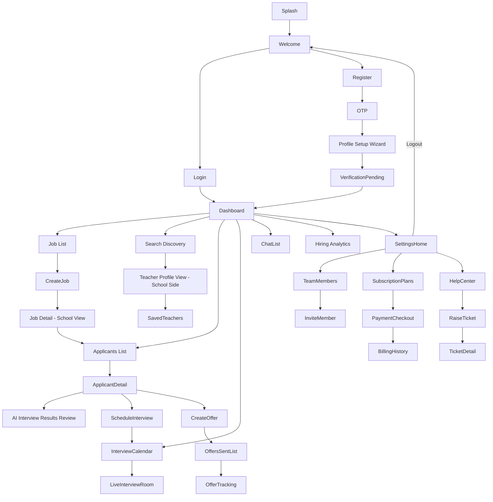

---

**END OF SCHOOL APP DOCUMENTATION**
